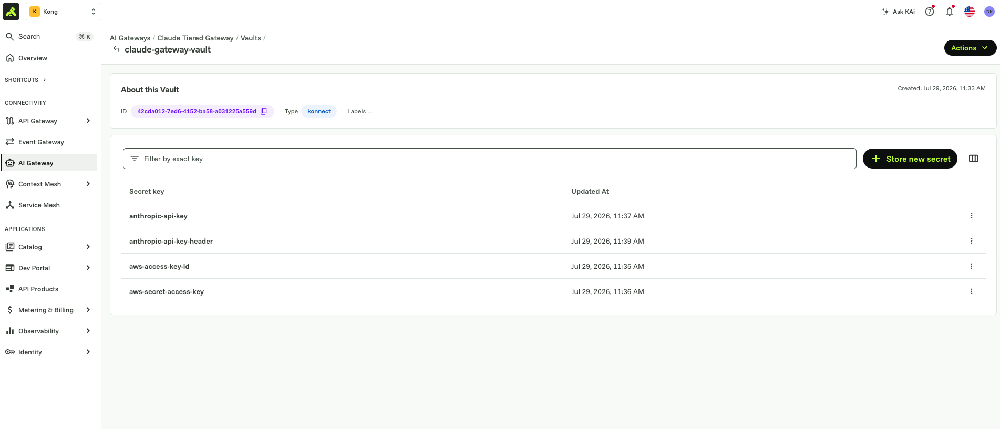

# Kong AI Gateway for Claude

Claude shows up inside an organization in more than one product at
once — Claude Code on developer laptops, Claude Chat in the browser,
Cowork for team workflows — each authenticating to Anthropic on its own
terms. That's fine at small scale, but it leaves no single place to
answer questions like "which team is burning through Opus budget" or
"can we cut this contractor's access off today." Kong AI Gateway sits in
front of all of them as one policy point: it terminates every request on
its way to Anthropic, checks the caller's identity against your IdP, and
applies model access and spend limits by group — all without the
developer changing how they invoke Claude Code, Chat, or Cowork.
Concretely, that means:

- **Gate** — every request must carry a valid, signed bearer token from
  your identity provider before it reaches a Claude model.
- **Tier** — which models a caller can even see (`GET /v1/models`) and
  use is driven by their identity-provider group.
- **Budget** — spend limits are enforced per group, in dollars, computed
  from each model's real input/output token cost.

This is the AI Gateway 2.0 track and the one actively maintained in this
repo. An earlier build of the same idea on classic Kong Gateway (1.x,
decK-based) lives in [`classic-kong-gateway/`](classic-kong-gateway/) for
reference, with its own README.

## Contents

- [Architecture](#architecture)
- [What you'll build](#what-youll-build)
- [Prerequisites](#prerequisites)
- [Steps](#steps)
  - [1. Deploy the gateway](#1-deploy-the-gateway)
  - [2. Add Claude models](#2-add-claude-models)
  - [3. Configure the vault](#3-configure-the-vault)
  - [4. Enable SSO](#4-enable-sso)
  - [5. Filter models by group](#5-filter-models-by-group)
  - [6. Add a usage dashboard](#6-add-a-usage-dashboard)
  - [7. Set spend limits](#7-set-spend-limits)
- [Repo layout](#repo-layout)
- [Secrets](#secrets)

## Architecture


The control plane runs in Konnect; the data plane runs wherever you
choose (a laptop, your VPC, Kubernetes) and connects back over mTLS. This
is a **hybrid** deployment — Kong AI Gateway also supports fully
self-hosted and fully managed deployments if you need a different
posture.

## What you'll build

- One AI Gateway 2.0 control plane that can expose the full Claude model
  catalog — Sonnet, Haiku, and Opus variants, plus Fable — behind a
  single `/anthropic` route, routed to Anthropic directly. You choose
  which models to expose; nothing here caps you to a fixed count.
- SSO in front of every model, via any OIDC-compliant identity provider.
  This walkthrough uses Okta, but the same steps work with Entra ID,
  Auth0, or anything else that speaks OIDC.
- User- and group-based model visibility — which models a caller can see
  and call is driven by their identity-provider group, not by who they
  are individually.
- Spend limits as their own, separate layer on top of that. Budgets can
  be scoped per consumer or per group, tracked in dollars (computed from
  each model's real cost) or in raw tokens, over whatever time window
  fits your use case. This walkthrough sets a cost-based budget per
  group, but the policy supports finer- or coarser-grained setups.

## Prerequisites

You'll need:

- A Kong Konnect account with AI Gateway 2.0 enabled — [sign up for a
  free trial](https://cloud.konghq.com/register) if you don't have one.
- A Konnect **Personal Access Token** — profile menu → *Personal access
  tokens* → *Generate*.
- [`kongctl`](https://developer.konghq.com/kongctl/) 1.8.0 or newer,
  installed and on your `PATH`.
- An Anthropic API key with access to the models you plan to expose.
- `jq`, used by the vault bootstrap script.
- Docker. This walkthrough runs the data plane locally as a container;
  Kong AI Gateway's data plane also runs on a plain VM or inside
  Kubernetes if that fits your environment better.

Copy the env template and fill in the values above before starting:

```bash
cp .env.example .env
```

### If you're using SSO

Steps 4 and 5 add SSO and group-based access. Kong AI Gateway's identity
provider works with any OIDC-compliant provider — this walkthrough uses
Okta, but the same setup applies to Entra ID or others. If you want SSO,
set up your OIDC app before you get there:

1. Register an OIDC app with your provider (Web application,
   Authorization Code grant). See Okta's [OIDC app setup
   guide](https://developer.okta.com/docs/guides/implement-grant-type/authcode/main/)
   or Microsoft's [Entra ID app registration
   quickstart](https://learn.microsoft.com/en-us/entra/identity-platform/quickstart-register-app)
   for two worked examples.
2. Add your gateway's data-plane URL as an allowed redirect URI.
3. Add a custom claim named `team` to the access token, with a value per
   user or group — this example expects `kong-premium` and
   `kong-standard`, which Step 5 uses to tier model visibility and spend
   by group.
4. Note the issuer URL, client ID, and client secret for `.env`.

If you don't need SSO, skip Steps 4 and 5 and every model will be open
once Step 2 is applied. Kong AI Gateway also ships a built-in identity
provider, so you can still restrict access with simple API keys instead
of a full OIDC flow.

## Steps

Each step applies one file, cumulatively — every file is the full desired
state for everything up to that point.

### 1. Deploy the gateway

Creates the AI Gateway 2.0 control plane.


```yaml
ai_gateways:
- ref: claude-tiered-gateway
  name: claude-tiered-gateway
  display_name: "Claude Tiered Gateway"
```

```bash
kongctl apply -f 1-gateway.yaml
```

Then connect a data plane: in Konnect, open the gateway → **Data plane
nodes** → **Configure data plane** → **Docker**. This generates a
`docker run` command with your control plane's endpoints and a short-lived
client certificate — copy and run it:

```bash
docker run -d \
  -e "KONG_ROLE=data_plane" \
  -e "KONG_DATABASE=off" \
  -e "KONG_CLUSTER_MTLS=pki" \
  -e "KONG_CLUSTER_CONTROL_PLANE=<control-plane-host>:443" \
  -e "KONG_CLUSTER_SERVER_NAME=<control-plane-host>" \
  -e "KONG_CLUSTER_TELEMETRY_ENDPOINT=<telemetry-host>:443" \
  -e "KONG_CLUSTER_TELEMETRY_SERVER_NAME=<telemetry-host>" \
  -e "KONG_CLUSTER_CERT=..." \
  -e "KONG_CLUSTER_CERT_KEY=..." \
  kong/kong-ai-gateway-dev:2.0.1-rc.5
```

The data plane proxies traffic on `8000` (HTTP) and `8443` (HTTPS). It
shows as **Connected** in Konnect within a few seconds.

**Verify:** `kongctl diff -f 1-gateway.yaml` reports no changes.

### 2. Add Claude models

Adds the model provider and one `ai_gateway_model` per Claude model, each
behind `/anthropic`, distinguished by the `model` field in the request
body.

Each provider holds the upstream credential:

```yaml
model_providers:
- ref: anthropic-direct
  type: anthropic
  config:
    auth:
      headers:
      - name: x-api-key
        value: "{vault://claude-gateway-vault/anthropic-api-key}"
```

Each model picks a target model id from the request body, and carries the
cost fields Step 7's spend limits are computed from:

```yaml
models:
- ref: claude-opus
  config:
    route:
      model:
        body:
          model: [claude-opus-4-8]
  targets:
  - provider: anthropic-direct
    config:
      input_cost: 15   # USD / million input tokens
      output_cost: 75  # USD / million output tokens
```

```bash
kongctl apply -f 2-claude-integration.yaml
```

**Verify:** `kongctl diff -f 2-claude-integration.yaml` reports no
changes.

### 3. Configure the vault

Every credential is referenced as `{vault://claude-gateway-vault/<key>}`,
never inlined. One command sets up the vault and seeds it from `.env`:

```bash
scripts/bootstrap-vault.sh
```

This creates a Konnect config store and vault (if they don't already
exist) and seeds the following keys. Re-run any time a value in `.env`
changes — it updates in place.



| Vault key | From `.env` |
|-----------|-------------|
| `anthropic-api-key` | `ANTHROPIC_API_KEY` |
| `anthropic-api-key-header` | `ANTHROPIC_API_KEY_HEADER` |
| `okta-issuer` | `OKTA_ISSUER` |
| `okta-client-id` | `OKTA_CLIENT_ID` |
| `okta-client-secret` | `OKTA_CLIENT_SECRET` |
| `oidc-cache-tokens-salt` | `OIDC_CACHE_TOKENS_SALT` |

### 4. Enable SSO

Requires a valid Okta-issued bearer token on every model. Skip this step
(and Step 5) if you don't need SSO.

```yaml
identity_providers:
- ref: okta-groups-idp
  type: openid-connect
  config:
    issuer: "{vault://claude-gateway-vault/okta-issuer}"
    client_id: ["{vault://claude-gateway-vault/okta-client-id}"]
    client_secret: ["{vault://claude-gateway-vault/okta-client-secret}"]

consumer_groups:
- name: kong-premium
- name: kong-standard
```

```bash
kongctl apply -f 3-identity-provider.yaml
```

`kongctl` doesn't support one identity-provider field yet —
`consumer_groups_claim`, which maps the Okta `team` claim to the
`consumer_groups` above. Set it once after every apply to this file:

```bash
GW=<your-gateway-id>
IDP=<your-identity-provider-id>
kongctl api put "/v1/ai-gateways/${GW}/identity/${IDP}" -f - <<'JSON'
{
  "name": "okta-groups-idp",
  "display_name": "Okta OIDC (group claim)",
  "type": "openid-connect",
  "config": {
    "issuer": "{vault://claude-gateway-vault/okta-issuer}",
    "client_id": ["{vault://claude-gateway-vault/okta-client-id}"],
    "client_secret": ["{vault://claude-gateway-vault/okta-client-secret}"],
    "cache_tokens_salt": "{vault://claude-gateway-vault/oidc-cache-tokens-salt}",
    "auth_methods": ["bearer", "authorization_code"],
    "consumer_groups_claim": ["team"],
    "consumer_optional": true
  }
}
JSON
```

Find your gateway and identity-provider IDs with:

```bash
kongctl get ai-gateway -o json
kongctl get ai-gateway identity-providers --gateway-name "Claude Tiered Gateway" -o json
```

**Verify:** a request to `/anthropic` without a token is rejected.

### 5. Filter models by group

Adds a per-group view of the model catalog: `GET /anthropic/v1/models`
returns a different list depending on the caller's `team` claim, falling
back to the real Anthropic catalog for anyone with no recognized group.

```yaml
mcp_servers:
- ref: claude-models-premium
  type: passthrough-listener
  config:
    route:
      paths: [/anthropic/v1/models]
      headers:
        Team: [kong-premium]
  policies:
  - claude-models-premium-list   # returns a static, premium-only model list
```

```bash
kongctl apply -f 6-per-group-model-listing.yaml
```

**Verify:** call `GET /anthropic/v1/models` with a `kong-premium` token
and a `kong-standard` token — each returns a different model list.

### 6. Add a usage dashboard

`5-dashboard.json` holds a Konnect Analytics dashboard for cost, token,
and request visibility across models and consumers. Import it from the
Konnect UI (**Analytics** → **Dashboards** → **Import**), or apply it via
the API once you're ready to automate it.


### 7. Set spend limits

Adds a cost-based budget per group, computed from each model's
`input_cost`/`output_cost` — not a token count, since the 12 models span
a wide price range.

```yaml
policies:
- ref: tiered-cost-budget
  type: ai-rate-limiting-advanced
  config:
    identifier: consumer-group   # budget by group, not by consumer
    policies:
    - match:
      - type: consumer_group
        values: [kong-premium]
      limits:
      - limit: 5.0   # USD per window
        tokens_count_strategy: cost
    # kong-standard follows the same shape, limit: 1.0
```

```bash
kongctl apply -f 7-rate-limiting-policy.yaml
```

**Verify:** `kongctl diff -f 7-rate-limiting-policy.yaml` reports no
changes.

## Repo layout

```
├── README.md
├── .env.example                    # copy to .env and fill in
├── 1-gateway.yaml                   # Step 1
├── 2-claude-integration.yaml        # Step 2
├── 3-identity-provider.yaml         # Step 4
├── 6-per-group-model-listing.yaml   # Step 5
├── 5-dashboard.json                 # Step 6
├── 7-rate-limiting-policy.yaml      # Step 7
├── scripts/
│   └── bootstrap-vault.sh           # Step 3
├── images/                          # console screenshots
├── secrets/                         # local-only staging for real credentials (git-ignored)
└── classic-kong-gateway/            # earlier classic-Kong-Gateway (1.x, decK) build
```

## Secrets

Nothing in this repo ever holds a real credential. `.env` and everything
under `secrets/` are git-ignored — see
[`secrets/README.md`](secrets/README.md). Every `*.yaml` file references
secrets as `{vault://claude-gateway-vault/<key>}`, resolved by Kong at
request time.
