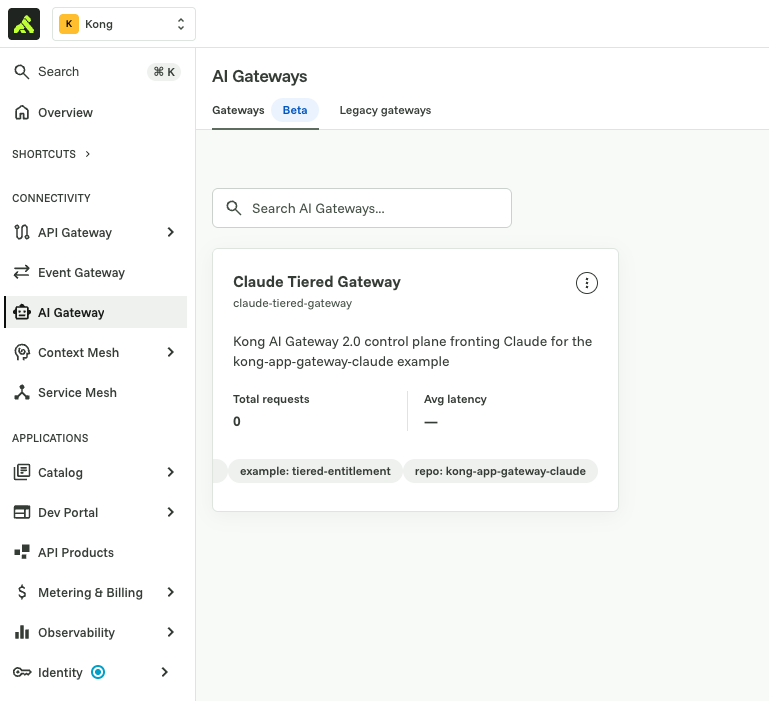
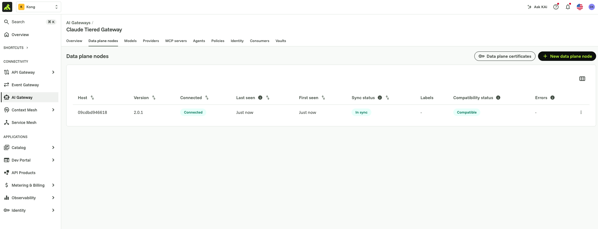
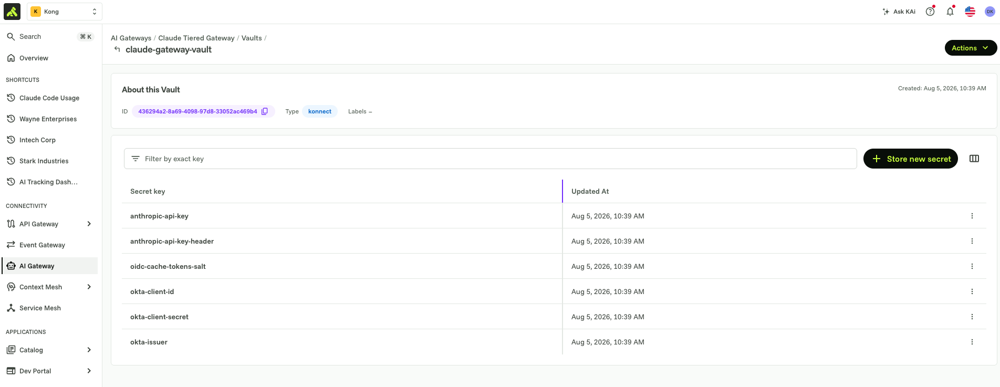
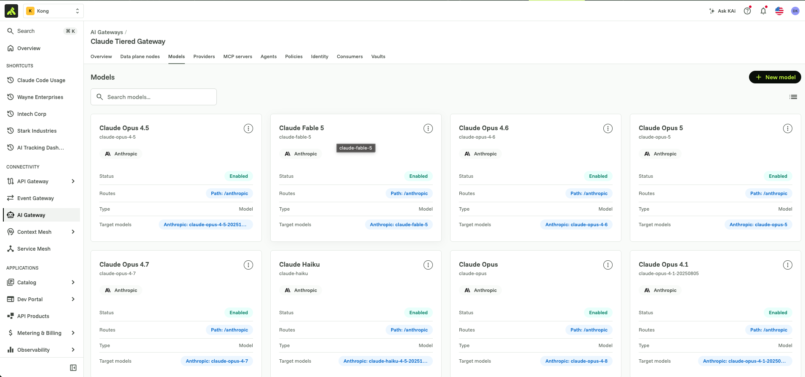
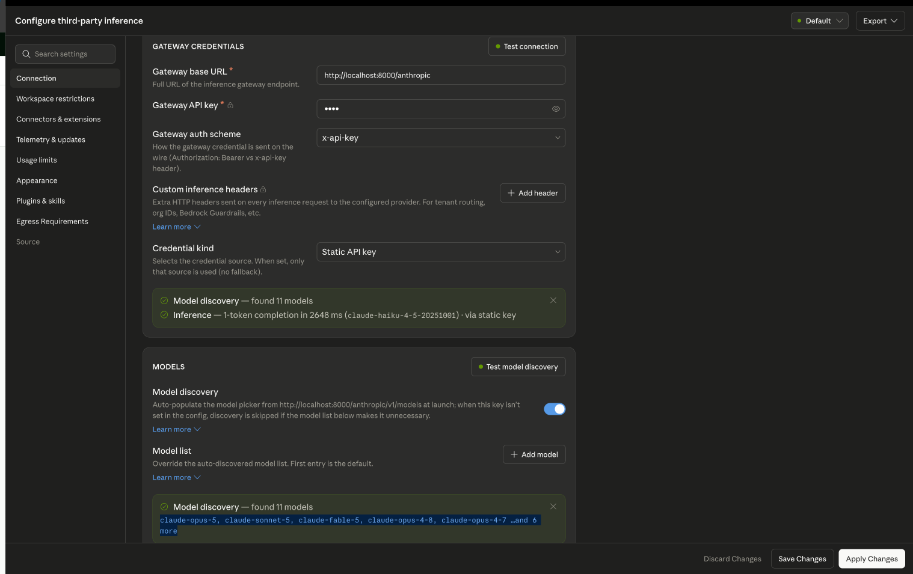
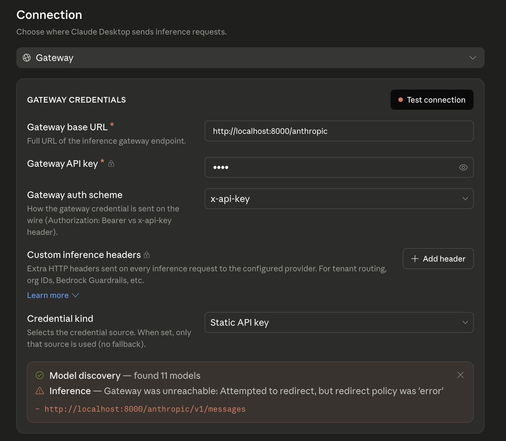
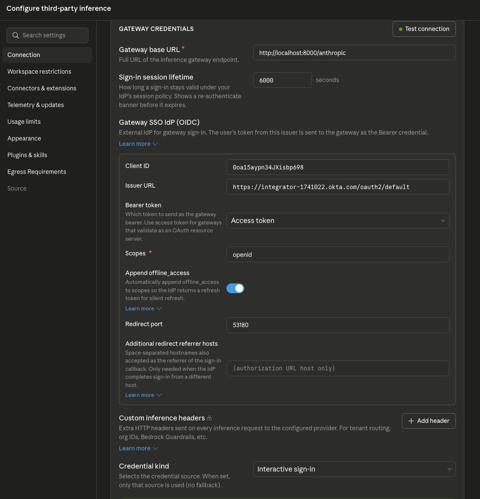
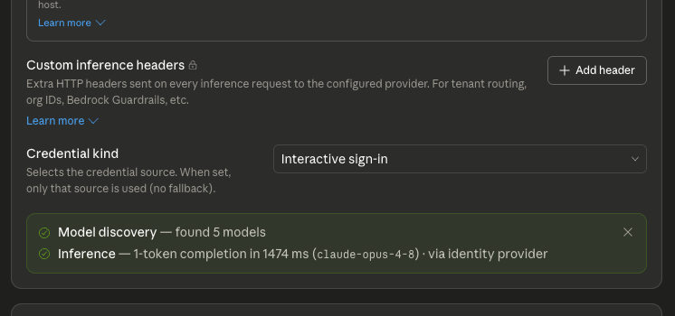
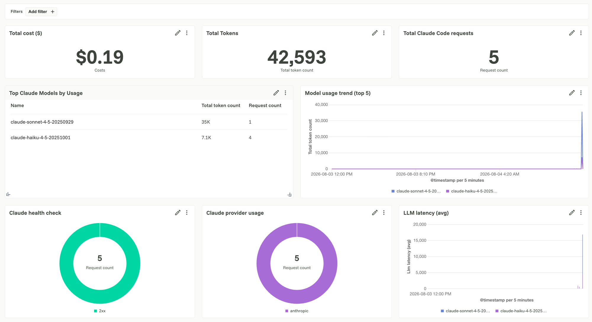
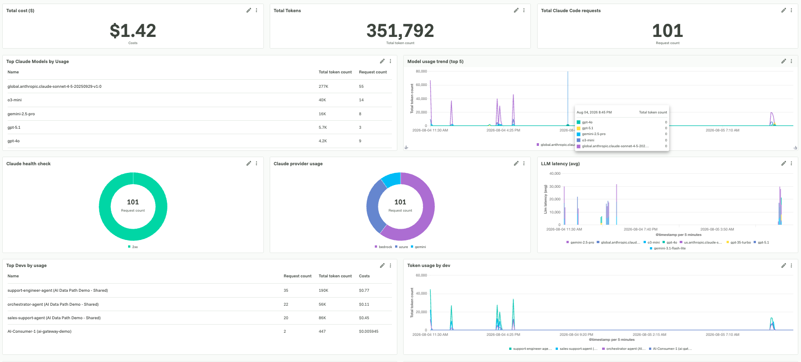

# Kong AI Gateway for Claude

Claude shows up inside an organization in more than one product at
once — Claude Code on developer laptops, Claude Chat in the browser,
Cowork for team workflows — each authenticating to Anthropic on its own
terms. That's fine at small scale, but it leaves no single place to
answer questions like "which team is burning through Opus budget" or
"can we cut this contractor's access off today." Kong AI Gateway sits in
front of all of them as one policy point: it terminates every request on
its way to Anthropic, checks the caller's identity against your IdP, and
applies model access and spend limits by group — all without the
developer changing how they invoke Claude Code, Chat, or Cowork.
Concretely, that means:

- **Gate** — every request must carry a valid, signed bearer token from
  your identity provider before it reaches a Claude model.
- **Tier** — which models a caller can even see (`GET /v1/models`) and
  use is driven by their identity-provider group.
- **Budget** — spend limits are enforced per group, in dollars, computed
  from each model's real input/output token cost.

This is the AI Gateway 2.0 track and the one actively maintained in this
repo. An earlier build of the same idea on classic Kong Gateway (1.x,
decK-based) lives in [`classic-kong-gateway/`](classic-kong-gateway/) for
reference, with its own README.

## Contents

- [Architecture](#architecture)
- [What you'll build](#what-youll-build)
- [Prerequisites](#prerequisites)
- [Steps](#steps)
  - [1. Create the control plane and deploy the gateway](#1-create-the-control-plane-and-deploy-the-gateway)
  - [2. Configure the vault](#2-configure-the-vault)
  - [3. Add Claude models](#3-add-claude-models)
  - [4. Enable SSO](#4-enable-sso)
  - [5. Filter models by group](#5-filter-models-by-group)
  - [6. Add a usage dashboard](#6-add-a-usage-dashboard)
  - [7. Set spend limits](#7-set-spend-limits)
- [Repo layout](#repo-layout)
- [Secrets](#secrets)

## Architecture


The control plane runs in Konnect; the data plane runs wherever you
choose (a laptop, your VPC, Kubernetes) and connects back over mTLS. This
is a **hybrid** deployment — Kong AI Gateway also supports fully
self-hosted and fully managed deployments if you need a different
posture.

## What you'll build

- One AI Gateway 2.0 control plane that can expose the full Claude model
  catalog — Sonnet, Haiku, and Opus variants, plus Fable — behind a
  single `/anthropic` route, routed to Anthropic directly. You choose
  which models to expose; nothing here caps you to a fixed count.
- SSO in front of every model, via any OIDC-compliant identity provider.
  This walkthrough uses Okta, but the same steps work with Entra ID,
  Auth0, or anything else that speaks OIDC.
- User- and group-based model visibility — which models a caller can see
  and call is driven by their identity-provider group, not by who they
  are individually.
- Spend limits as their own, separate layer on top of that. Budgets can
  be scoped per consumer or per group, tracked in dollars (computed from
  each model's real cost) or in raw tokens, over whatever time window
  fits your use case. This walkthrough sets a cost-based budget per
  group, but the policy supports finer- or coarser-grained setups.

## Prerequisites

You'll need:

- A Kong Konnect account with AI Gateway 2.0 enabled — [sign up for a
  free trial](https://cloud.konghq.com/register) if you don't have one.
- A Konnect **Personal Access Token** — profile menu → *Personal access
  tokens* → *Generate*.
- [`kongctl`](https://developer.konghq.com/kongctl/) 1.10.0 or newer,
  installed and on your `PATH`.
- An Anthropic API key with access to the models you plan to expose.
- `jq`, used by the vault bootstrap script.
- Docker. This walkthrough runs the data plane locally as a container;
  Kong AI Gateway's data plane also runs on a plain VM or inside
  Kubernetes if that fits your environment better.

Copy the env template and fill in the values above before starting:

```bash
cp .env.example .env
```

`kongctl` (the commands you'll run in every step below) doesn't read
`.env` on its own — it looks for two specific environment variables,
`KONGCTL_DEFAULT_KONNECT_PAT` and `KONGCTL_DEFAULT_KONNECT_REGION`. Load
your `.env` values into those before running any `kongctl apply`/`diff`
command:

```bash
set -a && source .env && set +a
export KONGCTL_DEFAULT_KONNECT_PAT="$KONNECT_TOKEN"
export KONGCTL_DEFAULT_KONNECT_REGION="$KONNECT_REGION"
```

Do this once per shell session — `scripts/bootstrap-vault.sh` (Step 2)
sets these for itself internally, but the `kongctl apply -f ...`
commands you run directly in Steps 1, 2, 4, 5, and 7 need them exported
in your own shell.

### If you're using SSO

Steps 4 and 5 add SSO and group-based access. Kong AI Gateway's identity
provider works with any OIDC-compliant provider — this walkthrough uses
Okta, but the same setup applies to Entra ID or others. If you want SSO,
set up your OIDC app before you get there:

1. Register an OIDC app with your provider (Web application,
   Authorization Code grant). See Okta's [OIDC app setup
   guide](https://developer.okta.com/docs/guides/implement-grant-type/authcode/main/)
   or Microsoft's [Entra ID app registration
   quickstart](https://learn.microsoft.com/en-us/entra/identity-platform/quickstart-register-app)
   for two worked examples.
2. Add your gateway's data-plane URL as an allowed redirect URI — this is
   what Konnect's own "Interactive sign-in" test flow uses. If you also
   want to test with a native client like Claude Desktop, add
   `http://127.0.0.1:53180/callback` too — that's the fixed loopback port
   Desktop's OIDC flow listens on for its own callback (see Step 4's
   "Test it with a real client").
3. Add a custom claim named `team` to the access token, with a value per
   user or group — this example expects `kong-premium` and
   `kong-standard`, which Step 5 uses to tier model visibility and spend
   by group.
4. Note the issuer URL, client ID, and client secret for `.env`.

If you don't need SSO, skip Steps 4 and 5 and every model will be open
once Step 3 is applied. Kong AI Gateway also ships a built-in identity
provider, so you can still restrict access with simple API keys instead
of a full OIDC flow.

## Steps

Each step below applies one numbered YAML file (`1-gateway.yaml`,
`2-claude-integration.yaml`, and so on) with `kongctl apply -f <file>`.
These are declarative kongctl configs, not patches: every file is the
**full desired state** of the control plane for everything up to and
including that step, so `2-claude-integration.yaml` repeats everything
`1-gateway.yaml` created and adds the model provider and models on top,
`3-identity-provider.yaml` repeats that and adds the identity provider,
and so on. `kongctl apply` reconciles the live control plane to match the
file exactly — that's also why `git diff` between two consecutive step
files shows precisely what that step introduced, and why `kongctl diff
-f <file>` reports no changes once a file has already been applied (the
"Verify" line under each step below).

### 1. Create the control plane and deploy the gateway

Creates the AI Gateway 2.0 control plane, then connects a data plane to
it so the gateway can actually proxy traffic.

```yaml
ai_gateways:
- ref: claude-tiered-gateway
  name: claude-tiered-gateway
  display_name: "Claude Tiered Gateway"
```

```bash
kongctl apply -f 1-gateway.yaml
```



Then connect a data plane: in Konnect, open the gateway → **Data plane
nodes** → **Configure data plane** → **Docker**. This generates a
`docker run` command with your control plane's endpoints and a short-lived
client certificate — copy and run it:

```bash
docker run -d \
  -e "KONG_ROLE=data_plane" \
  -e "KONG_DATABASE=off" \
  -e "KONG_CLUSTER_MTLS=pki" \
  -e "KONG_CLUSTER_CONTROL_PLANE=<control-plane-host>:443" \
  -e "KONG_CLUSTER_SERVER_NAME=<control-plane-host>" \
  -e "KONG_CLUSTER_TELEMETRY_ENDPOINT=<telemetry-host>:443" \
  -e "KONG_CLUSTER_TELEMETRY_SERVER_NAME=<telemetry-host>" \
  -e "KONG_CLUSTER_CERT=..." \
  -e "KONG_CLUSTER_CERT_KEY=..." \
  kong/kong-ai-gateway-dev:2.0.1-rc.5
```

The data plane proxies traffic on `8000` (HTTP) and `8443` (HTTPS). It
shows as **Connected** in Konnect within a few seconds.



**Verify:** `kongctl diff -f 1-gateway.yaml` reports no changes.

### 2. Configure the vault

Every credential is referenced as `{vault://claude-gateway-vault/<key>}`,
never inlined. One command sets up the vault and seeds it from `.env`:

```bash
scripts/bootstrap-vault.sh
```

This creates a Konnect config store and vault (if they don't already
exist) and seeds the following keys. Re-run any time a value in `.env`
changes — it updates in place.



| Vault key | From `.env` |
|-----------|-------------|
| `anthropic-api-key` | `ANTHROPIC_API_KEY` |
| `anthropic-api-key-header` | `ANTHROPIC_API_KEY_HEADER` |
| `okta-issuer` | `OKTA_ISSUER` |
| `okta-client-id` | `OKTA_CLIENT_ID` |
| `okta-client-secret` | `OKTA_CLIENT_SECRET` |
| `oidc-cache-tokens-salt` | `OIDC_CACHE_TOKENS_SALT` |

Doing this before Step 3 means the model provider you add next can
reference `{vault://claude-gateway-vault/anthropic-api-key}` immediately,
instead of pointing at a secret that doesn't exist yet.

### 3. Add Claude models

Adds the model provider and one `ai_gateway_model` per Claude model, each
behind `/anthropic`, distinguished by the `model` field in the request
body.

Each provider holds the upstream credential:

```yaml
model_providers:
- ref: anthropic-direct
  type: anthropic
  config:
    auth:
      headers:
      - name: x-api-key
        value: "{vault://claude-gateway-vault/anthropic-api-key}"
```

Each model picks a target model id from the request body, and carries the
cost fields Step 7's spend limits are computed from:

```yaml
models:
- ref: claude-opus
  config:
    route:
      model:
        body:
          model: [claude-opus-4-8]
  targets:
  - provider: anthropic-direct
    config:
      input_cost: 15   # USD / million input tokens
      output_cost: 75  # USD / million output tokens
```

`ai_gateway_model`s above only route inference calls (`POST`, matched on
the `model` field in the request body) — a model *list* request has no
body to match on, so `GET /anthropic/v1/models` needs its own passthrough
listener, plus a policy to inject the Anthropic key on the way out. That
policy sets the header both ways — `add` covers a caller that sends none,
`replace` overwrites one a caller already sent — so the real key always
wins either way:

```yaml
policies:
- ref: anthropic-add-key
  type: request-transformer-advanced
  config:
    add:
      headers:
      - "{vault://claude-gateway-vault/anthropic-api-key-header}"
    replace:
      headers:
      - "{vault://claude-gateway-vault/anthropic-api-key-header}"

mcp_servers:
- ref: anthropic-models-endpoint
  type: passthrough-listener
  config:
    url: https://api.anthropic.com/v1/models
    route:
      paths: [/anthropic/v1/models]
  policies:
  - anthropic-add-key
```

This is the ungated, unconditioned listing every caller gets. Step 5 adds
two more listeners on the same path, matched on a `Team` header, that
intercept it for callers with a recognized group and return a filtered
list instead — this one keeps serving as the fallback for everyone else.

```bash
kongctl apply -f 2-claude-integration.yaml
```



**Verify:** `kongctl diff -f 2-claude-integration.yaml` reports no
changes, and `curl http://localhost:8000/anthropic/v1/models` returns the
real Anthropic model catalog (no group filtering yet — that's Step 5).

#### Test it with a real client

Point a Claude client's third-party inference settings at Kong instead of
Anthropic directly, to confirm inference and model discovery both work
end-to-end before any auth layers on top in Step 4:

| Setting | Value |
|---|---|
| Gateway base URL | `http://localhost:8000/anthropic` |
| Gateway API key | any placeholder value for now — Kong doesn't require one until Step 4 enables SSO; swap it for a real Okta-issued bearer token once that's applied |
| Gateway auth scheme | `x-api-key` |



Both **Test connection** and **Test model discovery** should come back
green: model discovery lists the models from this step, and inference
round-trips a real completion through Kong to Anthropic and back.

### 4. Enable SSO

Requires a valid Okta-issued bearer token on every model. Skip this step
(and Step 5) if you don't need SSO.

```yaml
identity_providers:
- ref: okta-groups-idp
  type: openid-connect
  config:
    issuer: "{vault://claude-gateway-vault/okta-issuer}"
    client_id: ["{vault://claude-gateway-vault/okta-client-id}"]
    client_secret: ["{vault://claude-gateway-vault/okta-client-secret}"]

consumer_groups:
- name: kong-premium
- name: kong-standard
```

```bash
kongctl apply -f 3-identity-provider.yaml
```

`consumer_groups_claim` — which maps the Okta `team` claim onto the
`consumer_groups` above — is a supported field on the Kong AI Gateway
identity provider API. `kongctl`'s declarative schema (1.10.0) doesn't
expose it yet, so it can't be set from the YAML above; set it once via a
direct API call after every apply to this file instead:

```bash
GW=<your-gateway-id>
IDP=<your-identity-provider-id>
kongctl api put "/v1/ai-gateways/${GW}/identity/${IDP}" -f - <<'JSON'
{
  "name": "okta-groups-idp",
  "display_name": "Okta OIDC (group claim)",
  "type": "openid-connect",
  "config": {
    "issuer": "{vault://claude-gateway-vault/okta-issuer}",
    "client_id": ["{vault://claude-gateway-vault/okta-client-id}"],
    "client_secret": ["{vault://claude-gateway-vault/okta-client-secret}"],
    "cache_tokens_salt": "{vault://claude-gateway-vault/oidc-cache-tokens-salt}",
    "auth_methods": ["bearer", "authorization_code"],
    "consumer_groups_claim": ["team"],
    "consumer_optional": true
  }
}
JSON
```

Find your gateway and identity-provider IDs with:

```bash
kongctl get ai-gateway -o json
kongctl get ai-gateway identity-providers --gateway-name "Claude Tiered Gateway" -o json
```

**Verify:** a request to `/anthropic` without a token is rejected, and so
is `GET /anthropic/v1/models` once the `okta-models-auth` policy below is
applied.

#### Test it with a real client

The static-key setup from Step 3's client test now fails on inference,
since every model carries `access.identity_providers: [okta-groups-idp]`
and a dummy key isn't a valid Okta token. Model discovery still
succeeds — `GET /anthropic/v1/models` isn't gated by an identity provider
the way models are, only by the unconditioned listener from Step 3:



That gap is real, not just a stale key issue: `ai_gateway_mcp_server`s
have no `access.identity_providers` field at all (`kongctl explain
ai_gateway.mcp_servers.access --extended` only lists
`acl_attribute_type`/`acls`/`default_tool_acls`), so there's no
declarative way to point `anthropic-models-endpoint` at `okta-groups-idp`
the way the models above are. The fix is to attach the `openid-connect`
plugin directly as its own policy instead:

```yaml
policies:
- ref: okta-models-auth
  type: openid-connect
  config:
    issuer: "{vault://claude-gateway-vault/okta-issuer}"
    client_id: ["{vault://claude-gateway-vault/okta-client-id}"]
    client_secret: ["{vault://claude-gateway-vault/okta-client-secret}"]
    cache_tokens_salt: "{vault://claude-gateway-vault/oidc-cache-tokens-salt}"
    auth_methods: ["bearer"]
    consumer_optional: true

mcp_servers:
- ref: anthropic-models-endpoint
  policies:
  - okta-models-auth
  - anthropic-add-key   # unchanged from Step 3
```

This is already part of `3-identity-provider.yaml` (re-running `kongctl
apply -f 3-identity-provider.yaml` picks it up) — once applied, model
discovery requires the same valid token inference does.

To get a real token, switch the client from a static key to interactive
OIDC sign-in instead:

1. **Gateway base URL**: same as before — `http://localhost:8000/anthropic`.
2. **Sign-in session lifetime**: how long a sign-in stays valid before the
   client shows a re-authenticate banner (its own timer, independent of
   Kong's session handling) — e.g. `6000` seconds.
3. **Credential kind**: change from `Static API key` (Step 3) to
   `Interactive sign-in` — this is what reveals the **Gateway SSO IdP
   (OIDC)** panel below.
4. **Gateway SSO IdP (OIDC)**:
   - **Client ID**: your `OKTA_CLIENT_ID`.
   - **Issuer URL**: your Okta issuer's **base** URL, e.g.
     `https://<your-okta-domain>/oauth2/default` — **not** the full
     `/.well-known/openid-configuration` discovery URL. This is different
     from the `okta-issuer` vault value, which Kong's `openid-connect`
     identity provider needs in the full discovery-URL form; the client
     derives the discovery document itself from the base issuer.
   - **Bearer token**: `Access token` — matches the `bearer` entry in
     `auth_methods` above, which validates an OAuth access token.
   - **Scopes**: `openid`.
   - **Append offline_access**: **on** — so the IdP returns a refresh
     token for silent renewal.
   - **Redirect port**: `53180` — this is why
     `http://127.0.0.1:53180/callback` needs to be a registered redirect
     URI in Okta (see Prerequisites): the client opens your browser for
     login and listens on this local port for the callback.
   - **Additional redirect referrer hosts**: leave as the default
     (authorization URL host only) unless Okta completes sign-in from a
     different host than the authorization URL's.

   
5. Custom inference headers aren't needed for this step.
6. Click **Test connection** — you'll be redirected to log in: the client
   opens your browser and sends you to Okta to sign in (including MFA, if
   your org requires it). Once you complete sign-in, **Test connection**
   shows green, and both model discovery and inference work, using the
   real access token instead of the static key.

### 5. Filter models by group

Layers a per-group view on top of the `anthropic-models-endpoint`
listener from Step 3: `GET /anthropic/v1/models` returns a different list
depending on the caller's `team` claim, falling back to the real
Anthropic catalog from Step 3 for anyone with no recognized group. Both
new listeners also carry the `okta-models-auth` policy from Step 4, so a
forged `Team` header alone can't reach the filtered list without a real
token — the pre-function below that reads the claim doesn't verify the
JWT signature.

```yaml
mcp_servers:
- ref: claude-models-premium
  type: passthrough-listener
  config:
    route:
      paths: [/anthropic/v1/models]
      headers:
        Team: [kong-premium]
  policies:
  - okta-models-auth
  - claude-models-premium-list   # returns a static, premium-only model list
```

```bash
kongctl apply -f 6-per-group-model-listing.yaml
```

**Verify:** call `GET /anthropic/v1/models` with a `kong-premium` token
and a `kong-standard` token — each returns a different model list.

#### What's in the access token

The `team` claim comes back as a plain custom claim on the Okta access
token, alongside the standard OIDC ones. Decoded, a `kong-standard`
user's token looks like:

```json
{
  "ver": 1,
  "jti": "AT.BD_sfLzShWmrnaHt3kX6CI0hhehOMyuaYOWK4EegfsQ",
  "iss": "https://integrator-1741022.okta.com/oauth2/default",
  "aud": "api://default",
  "iat": 1784432546,
  "exp": 1784436146,
  "cid": "0oa15d4jr5oIR5Eel698",
  "uid": "00u15c6ukel5jXEd0698",
  "scp": ["openid"],
  "auth_time": 1784432545,
  "sub": "declan.keane+standard@konghq.com",
  "company-groups": ["Everyone", "kong-standard"],
  "clientId": "0oa15d4jr5oIR5Eel698",
  "team": "kong-standard"
}
```

`company-groups` is Okta's own group-membership claim, listing every
group the user belongs to — this repo doesn't read it. `team` is the
single custom claim actually driving everything here: the
`consumer_groups_claim` on `okta-groups-idp` (Step 4) maps it onto a
Konnect consumer_group for spend limits (Step 7), and the
`team-claim-header` pre-function (this step) copies it onto a `Team`
header for the mcp_servers above to match on. Add `team` as a custom
claim on your Okta authorization server if it isn't already there — this
repo doesn't work off `company-groups` or any other group claim as-is.

#### Test it with a real client

Sign in as a user whose `team` claim resolves to `kong-standard` (5
Opus-tier models, per [What you'll build](#what-youll-build)) using the
same interactive OIDC connection from Step 4 — no client reconfiguration
needed, since Kong is deciding the list, not the client:



Model discovery now returns exactly the standard tier's 5 models instead
of the full catalog, and inference still succeeds through the identity
provider — confirming the group-based filtering and the SSO gate from
Step 4 are both applying to this token correctly.

### 6. Add a usage dashboard

`5-dashboard.json` holds a Konnect Analytics dashboard for cost, token,
and request visibility across models and consumers. Import it from the
Konnect UI (**Analytics** → **Dashboards** → **Import**), or apply it via
the API once you're ready to automate it.





### 7. Set spend limits

Adds a cost-based budget per group, computed from each model's
`input_cost`/`output_cost` — not a token count, since the 12 models span
a wide price range.

```yaml
policies:
- ref: tiered-cost-budget
  type: ai-rate-limiting-advanced
  config:
    identifier: consumer-group   # budget by group, not by consumer
    policies:
    - match:
      - type: consumer_group
        values: [kong-premium]
      limits:
      - limit: 5.0   # USD per window
        tokens_count_strategy: cost
    # kong-standard follows the same shape, limit: 1.0
```

```bash
kongctl apply -f 7-rate-limiting-policy.yaml
```

**Verify:** `kongctl diff -f 7-rate-limiting-policy.yaml` reports no
changes.

## Repo layout

```
├── README.md
├── .env.example                    # copy to .env and fill in
├── 1-gateway.yaml                   # Step 1
├── 2-claude-integration.yaml        # Step 3
├── 3-identity-provider.yaml         # Step 4
├── 6-per-group-model-listing.yaml   # Step 5
├── 5-dashboard.json                 # Step 6
├── 7-rate-limiting-policy.yaml      # Step 7
├── scripts/
│   └── bootstrap-vault.sh           # Step 2
├── images/                          # console screenshots
├── secrets/                         # local-only staging for real credentials (git-ignored)
└── classic-kong-gateway/            # earlier classic-Kong-Gateway (1.x, decK) build
```

## Secrets

Nothing in this repo ever holds a real credential. `.env` and everything
under `secrets/` are git-ignored — see
[`secrets/README.md`](secrets/README.md). Every `*.yaml` file references
secrets as `{vault://claude-gateway-vault/<key>}`, resolved by Kong at
request time.
