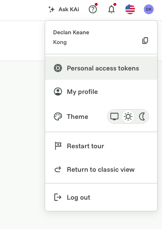
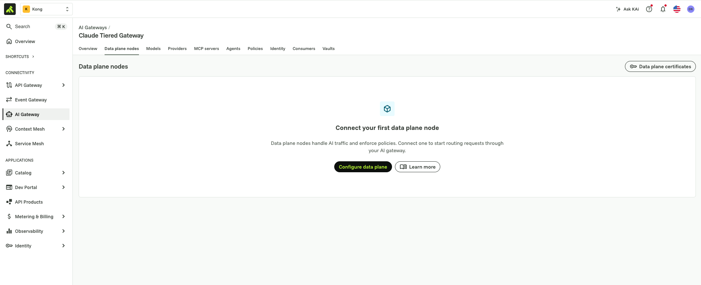
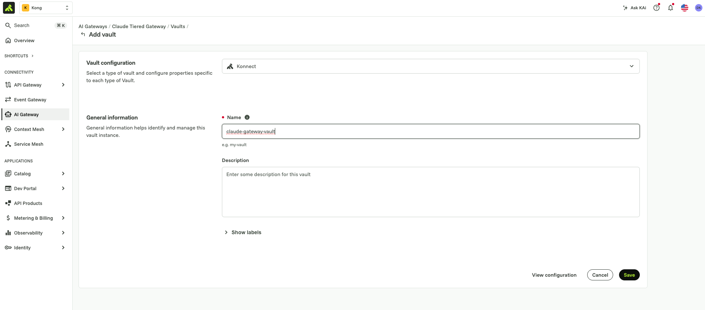

# Kong AI Gateway for Claude — tiered model entitlement

A worked example of putting **Kong AI Gateway 2.0** in front of **Claude**
— Chat, Cowork, and Code — so a platform team can gate, tier, and budget
access to Claude models by identity, without touching how developers use
the products themselves.

This is the AI Gateway 2.0 track and the only one actively maintained in
this repo. An earlier, classic-Kong-Gateway (1.x, decK-based) build of the
same idea lives in [`classic-kong-gateway/`](classic-kong-gateway/) for
reference — it has its own README and isn't touched by anything below.

## Contents

- [Why a gateway in front of Claude at all](#why-a-gateway-in-front-of-claude-at-all)
- [Kong Gateway: deploy it however your org needs to](#kong-gateway-deploy-it-however-your-org-needs-to)
- [Why Kong AI Gateway specifically](#why-kong-ai-gateway-specifically)
- [What this example builds](#what-this-example-builds)
- [Architecture](#architecture)
- [Prerequisites](#prerequisites)
- [Steps → files](#steps--files)
  - [1. Deploy the gateway (hybrid)](#1-deploy-the-gateway-hybrid)
  - [2. Integration setup with Claude](#2-integration-setup-with-claude)
  - [3. Vault integration](#3-vault-integration)
  - [4. SSO with OIDC (Okta)](#4-sso-with-oidc-okta)
  - [4 (continued). Per-group model listing](#4-continued-per-group-model-listing)
  - [5. Usage dashboard](#5-usage-dashboard)
  - [6 (final, for now). Per-group spend limits](#6-final-for-now-per-group-spend-limits)
- [Repo layout](#repo-layout)
- [Secrets](#secrets)
- [Status](#status)

## Why a gateway in front of Claude at all

Point any of the Claude apps at a base URL and they'll talk to whatever
sits behind it, as long as it speaks the API shape they expect. That's the
opening for a platform team: put something in the middle that holds the
real upstream credential, decides who gets which model, and meters what
it costs — instead of every developer holding a raw Anthropic key.

## Kong Gateway: deploy it however your org needs to

Nothing about Kong Gateway is Claude-specific — it's a general-purpose API
and AI gateway that happens to be a good fit here because of how it
deploys:

- **Fully self-hosted** — control plane and data plane both run on your
  own infrastructure, for orgs that can't have configuration or metadata
  leave their network.
- **Hybrid (this example)** — the control plane lives in Kong Konnect
  (Kong's SaaS), the data plane runs wherever you choose (your VPC, your
  laptop for a POC), connected back over mTLS. You get a managed control
  plane without your traffic ever routing through Kong's cloud.
- **Fully managed** — both planes run in Konnect; you configure, Kong
  operates.

Same gateway, same configuration model, three deployment postures. This
example uses hybrid because it's the middle ground most platform teams
land on: managed control plane, data plane close to (or inside) the
network the traffic actually needs to stay in.

## Why Kong AI Gateway specifically

A generic reverse proxy gets you a stable URL. Kong AI Gateway adds the
parts a platform team actually needs to run Claude access as a product:

- **Enterprise-grade** — Konnect is the same control plane used to run
  API gateways at large-scale, multi-team, multi-region orgs: RBAC over
  who can change gateway config, audit logging, and the operational
  tooling (declarative config via `kongctl`, GitOps-friendly) this
  directory is built around.
- **Advanced security policies** — OIDC/SSO in front of model access
  (Step 4 below), per-group/per-consumer ACLs, mTLS on the data-plane
  connection, and content-inspection style policies (prompt guarding,
  PII detection) available on the same gateway if you need them later.
- **MCP registry and governed MCP access** — Claude Code and Cowork both
  reach for MCP servers as freely as they reach for models. Kong AI
  Gateway's MCP registry gives a platform team the same control over
  *which MCP servers a group can reach* that this example applies to
  *which Claude models a group can reach* — one governance model for
  both surfaces, not two.

This example only builds out the model-access and spend-limit half. MCP
governance is the natural next module if you extend this directory.

## What this example builds

12 individual Claude models behind one route (`/anthropic`), each with its
own real Anthropic model id, cost fields, and access gate — plus
group-based model *listing* and *spend limits*, both keyed on the same
Okta `team` claim. Nobody gets a Kong-issued API key, and there's no
per-user Consumer to manage — every access decision is by group.

| Group | Sees in `/v1/models` | Chat spend budget |
|-------|----------------------|--------------------|
| `kong-premium` | all 12 models | $5.00 / 60s |
| `kong-standard` | 5 Opus-tier models | $1.00 / 60s |

Group membership comes from an Okta access token's `team` claim, mapped
to a real Konnect `consumer_group` via the identity provider's
`consumer_groups_claim` field (see Step 4).

## Architecture

```
┌────────────────────┐
│   Konnect (cloud)   │
│  control plane +    │
│  vault (secrets)    │
└──────────┬──────────┘
           │ hybrid mTLS
           ▼
┌───────────────┐        ┌──────────────────────┐        ┌────────────────────────┐
│  Claude Chat /│  HTTPS │   Kong AI Gateway     │  HTTPS │  Anthropic API /       │
│  Cowork / Code│───────▶│   (data plane)        │───────▶│  AWS Bedrock (Claude)  │
└───────────────┘        └──────────┬────────────┘        └────────────────────────┘
                                     │ validates bearer token
                                     ▼
                          ┌────────────────────┐
                          │   Okta (OIDC IdP)   │
                          └────────────────────┘
```

See `images/` for a rendered diagram and any console screenshots
(Okta app setup, Konnect consumer-group screens) — add them as you work
through the steps below.

## Prerequisites

- A Kong Konnect account with AI Gateway 2.0 enabled.
- A Konnect **Personal Access Token** — top-right profile menu → *Personal
  access tokens* → *Generate a Personal Access Token*, give it a name
  (e.g. `claude-integration`) and expiration, then *Generate*. This is
  what `kongctl` and any direct Konnect API calls authenticate with.

  <p float="left">
    
    
  </p>

- [`kongctl`](https://developer.konghq.com/kongctl/) **1.8.0 or newer**
  installed and authenticated with that token
  (`export KONGCTL_DEFAULT_KONNECT_PAT=...`, then `kongctl version` to
  confirm). AI Gateway 2.0 is beta and moving fast — 1.6.0 fails to create
  any `ai_gateway_model` at all (`config.model: property "alias" is
  unsupported`, regardless of what's in your YAML). `brew upgrade --cask
  kongctl` if you hit that error.
- An Anthropic API key and/or AWS Bedrock credentials with Claude model
  access — whichever provider(s) you want to route to.
- An Okta tenant (or any OIDC-compliant IdP) with admin access to create
  an app, assign users to groups, and add a `team` custom claim to the
  access token (values `kong-premium`/`kong-standard` — see Step 4).
- `jq` — required by `scripts/bootstrap-vault.sh` (Step 3).
- Docker, if you follow Step 1 below as written (self-managed data plane
  run locally) — swap in whatever runtime fits your environment otherwise.

Copy `.env.example` to `.env` and fill in the values above before starting
Step 1 — every step from here on reads from it, either directly
(`KONNECT_TOKEN`, `KONNECT_REGION`) or via `scripts/bootstrap-vault.sh`
(Step 3).

## Steps → files

Config is split into one `kongctl`-applied file per step, applied
cumulatively — each file is the full desired state for everything up to
that point, so `git diff` between files shows exactly what each step adds
(the same convention `classic-kong-gateway/`'s decK track uses).

| # | Step | File |
|---|------|------|
| 1 | Deploy the gateway (hybrid) | [`1-gateway.yaml`](1-gateway.yaml) |
| 2 | Integration setup with Claude | [`2-claude-integration.yaml`](2-claude-integration.yaml) |
| 3 | Vault integration | [`scripts/bootstrap-vault.sh`](scripts/bootstrap-vault.sh) (not a `kongctl` file — see below) |
| 4 | SSO with OIDC (Okta) | [`3-identity-provider.yaml`](3-identity-provider.yaml) |
| 4 *(continued)* | Per-group model listing | [`6-per-group-model-listing.yaml`](6-per-group-model-listing.yaml) |
| 5 | Usage dashboard | [`5-dashboard.json`](5-dashboard.json) |
| 6 *(final, for now)* | Per-group spend limits | [`7-rate-limiting-policy.yaml`](7-rate-limiting-policy.yaml) |

### 1. Deploy the gateway (hybrid)

`kongctl apply -f 1-gateway.yaml` creates the AI Gateway 2.0 control plane
in Konnect. Once applied, it shows up under **AI Gateway** in the Konnect
UI:


The data-plane half of "hybrid" isn't a `kongctl` resource — it's a
separate connect step, and this is where Kong's deployment flexibility
actually shows up. Open the gateway → **Data plane nodes** — empty at
first — and click **Configure data plane**:



You're asked *where* and *how* to run it:

- **Where**: self-managed (anywhere you can run a container or binary —
  on-prem, your own VPC, your laptop), serverless, or dedicated cloud
  (fully Kong-hosted). Serverless and dedicated cloud were "coming soon"
  at the time of writing — self-managed is available today and is what
  this example uses.
- **How**: Docker, a Linux binary, or Kubernetes — pick whatever matches
  your platform team's existing deployment tooling.


For this example we're keeping it simple and running the data plane as a
**Docker container on a local machine** — the same steps apply unchanged
if you're targeting a Kubernetes cluster or a VM in your own cloud
instead. Selecting *Docker* generates a ready-to-run `docker run` command
pre-filled with this control plane's cluster endpoints and a short-lived
mTLS client certificate — copy it and run it as-is. (Not screenshotted
here on purpose: the generated command embeds your real control-plane
hostname and a live client certificate, which shouldn't end up in a
screenshot in a git repo. Shape of the command is below with the
identifying values replaced.)

```bash
docker run -d \
  -e "KONG_ROLE=data_plane" \
  -e "KONG_DATABASE=off" \
  -e "KONG_VITALS=off" \
  -e "KONG_CLUSTER_MTLS=pki" \
  -e "KONG_CLUSTER_CONTROL_PLANE=<control-plane-host>:443" \
  -e "KONG_CLUSTER_SERVER_NAME=<control-plane-host>" \
  -e "KONG_CLUSTER_TELEMETRY_ENDPOINT=<telemetry-host>:443" \
  -e "KONG_CLUSTER_TELEMETRY_SERVER_NAME=<telemetry-host>" \
  -e "KONG_CLUSTER_CERT=..." \
  -e "KONG_CLUSTER_CERT_KEY=..." \
  kong/kong-ai-gateway-dev:2.0.1-rc.5   # or whatever tag Konnect's generated command shows you
```

By default the data plane exposes proxy traffic on `8000` (HTTP) and
`8443` (HTTPS):

```
$ docker container ls | grep :8443
09cdbd946618   kong/kong-ai-gateway-dev:2.0.1-rc.5   Up ...   0.0.0.0:8000->8000/tcp, 0.0.0.0:8443->8443/tcp   zealous_moore
```

Back in Konnect, the node shows up as **Connected** / **In sync** within a
few seconds:


If you'd rather not paste the generated cert/key inline, save them under
`secrets/` (git-ignored, never commit them) as e.g. `secrets/tls.crt` /
`secrets/tls.key`, and point `KONG_CLUSTER_CERT`/`KONG_CLUSTER_CERT_KEY` at
those file paths (or your own docker-compose service) instead of pasting
the certificate contents inline in the `docker run` command.

### 2. Integration setup with Claude

`2-claude-integration.yaml` adds the model providers (Anthropic direct,
AWS Bedrock) and one `ai_gateway_model` per Claude tier at `/anthropic` —
12 in total: the three original tiers (Sonnet, Haiku, Opus) plus every
other model id cross-checked against the live Anthropic catalog (see the
comment above `models:` in the file). Point any Claude app's custom base
URL setting at this route to confirm the round-trip works before layering
on auth or limits.

Preview, then apply:

```bash
kongctl diff -f 2-claude-integration.yaml    # shows what will change
kongctl apply -f 2-claude-integration.yaml   # creates/updates in place
```

`apply` re-declares the same `claude-tiered-gateway` control plane from
Step 1 (matched by namespace + `ref`, not by file), so this updates it
in place rather than creating a second gateway. Run the `diff` again
afterward and expect `No changes detected` — that's your confirmation
Konnect now matches this file exactly.

The model providers' `auth` headers reference
`{vault://claude-gateway-vault/...}` secrets that don't exist yet at this
point — that's fine. `kongctl apply` only creates the resources; the vault
reference is resolved by the data plane at request time, not by `kongctl`
at apply time. So this step succeeds even before Step 3 seeds the vault —
you just won't get a real response from `/anthropic` until the vault has
the matching keys.

`config.route.model` on the model resource matters more than it looks:
leaving it out entirely makes `kongctl` synthesize a default the live API
rejects. Set it explicitly with `body: {model: [<alias>]}` — this is the
shape that actually reads the model id out of the client's JSON request
body, which is where every real Claude app puts it.

**This file originally used `route.model.path_aliases` instead, and that
was a bug**, not just a stylistic choice — `path_aliases` reads the model
identifier from the URL *path*, not the body, and every real request goes
to the fixed path `/anthropic/v1/messages` with no model string in the
path at all. Every inference call therefore failed with a 503 whose body
read `"message": "name resolution failed"`, which looks like a DNS/network
problem but isn't: it's Kong's `ai-model-selector` finding nothing to
route to and falling back to a placeholder upstream host
(`ai-gateway.upstream.local`) that can't resolve. Root-caused via the
data-plane container logs — `[ai-model-selector] no model string found in
configured source: path` — then fixed by switching every model to `body`
and confirmed with a live curl test against all 12 models (each returned
past model-selection cleanly afterward, instead of the 503). `path_aliases`
had been recorded as "confirmed working" earlier in this repo's history;
that finding turned out to be wrong, or at best specific to an older
`kong/kong-ai-gateway-dev` image than what's running now (`2.0.1-rc.5`).

Each target's `config` also carries `input_cost`/`output_cost` (USD per
million tokens) now — required for any cost-based policy (like Step 6's
`ai-rate-limiting-advanced` budget) to compute anything meaningful; a
target with these unset contributes 0 to a cost-based limit and the limit
silently never trips. Values here mostly mirror the tiers already
established in `7-rate-limiting-policy.yaml`'s predecessor (Opus $15/$75, Sonnet $5/$15,
Haiku $0.80/$4 per million input/output tokens) — all are **placeholders**,
not verified current Anthropic pricing; `claude-fable-5` in particular has
no precedent anywhere in this repo and is priced as a pure guess at
Opus-tier. Replace with real pricing before any budget built on top of
these numbers means anything.

### 3. Vault integration

Every credential in these files is a `{vault://claude-gateway-vault/<key>}`
reference, never a literal value. `kongctl` has no declarative resource
for creating the vault or its backing config store (confirmed: no
`ai_gateway.config_stores` in `kongctl explain`'s output) — one command
handles all of it:

```bash
scripts/bootstrap-vault.sh
```

It reads `.env`, then: looks up the AI Gateway from Step 1, ensures a
config store exists, seeds/updates all 8 secrets this repo's files
reference (`anthropic-api-key`, `anthropic-api-key-header`,
`aws-access-key-id`, `aws-secret-access-key`, `okta-issuer`,
`okta-client-id`, `okta-client-secret`, `oidc-cache-tokens-salt` — Steps
4/6's secrets included, seeded here up front rather than incrementally),
and ensures a `claude-gateway-vault` vault entity points at that store.
Idempotent — re-run it any time a secret changes in `.env`, it'll update
in place rather than duplicate.




(Screenshots show the Konnect UI equivalent — **Vaults** → **Add vault**
→ **Store new secret** per credential — if you'd rather do this by hand
or just want to see what the script is doing under the hood.)

The script looks up the vault **before** guessing a config-store name —
worth knowing if you write similar tooling: an earlier version matched by
a guessed store name instead, didn't find the real one, and silently
created a second, orphaned store with duplicate secrets that nothing
actually used. Always derive `store_id` from the vault's own
`config.config_store_id` when a vault already exists; only fall back to
a name-based lookup/create when bootstrapping a vault for the first time.

### 4. SSO with OIDC (Okta)

`3-identity-provider.yaml` adds an `openid-connect` identity provider,
`okta-groups-idp`, requiring a valid Okta-issued bearer token. It's applied
as a **global policy**: every model in the file (all 12 — the full set from
Step 2, not just one) carries `access.identity_providers: [okta-groups-idp]`,
so any caller without a valid token is rejected on every model, not just a
hand-picked one.

This file re-declares the full model set from `2-claude-integration.yaml`
rather than just the original single model — this repo's files are
cumulative (each is the full desired state up to that point, see Step 1's
note), and `kongctl apply` never deletes, so a file that dropped models
here would leave them live but still try to recreate a stale duplicate on
top. If you've added models of your own in Step 2, carry them into this
file the same way before applying.

The four secrets this identity provider references (`okta-issuer`,
`okta-client-id`, `okta-client-secret`, `oidc-cache-tokens-salt`) are
already in the vault — Step 3's `scripts/bootstrap-vault.sh` seeds all 8
secrets this repo needs up front, not incrementally per step. Nothing to
do here except make sure `OKTA_*`/`OIDC_CACHE_TOKENS_SALT` were actually
set in `.env` before you ran it.

Preview, then apply:

```bash
kongctl diff -f 3-identity-provider.yaml    # expect 3 to add, 12 to change
kongctl apply -f 3-identity-provider.yaml
```

The 3 additions are the identity provider plus two consumer groups
(`kong-premium`, `kong-standard`); the 12 changes are every existing model
picking up the new `access` block — nothing else about them changes.

**Group-based, via a field kongctl can't manage.** Earlier revisions of
this file claimed there was no way to derive group membership from an
Okta claim — that finding was wrong, or at least incomplete.
`consumer_groups_claim` **is** a real, live field on the openid-connect
identity provider's `config` — confirmed by testing directly against the
Konnect API (a raw `PUT` to `/v1/ai-gateways/{id}/identity/{id}` with
`consumer_groups_claim` in the body succeeds). It's just missing from
`kongctl`'s client schema (`kongctl explain
ai_gateway.identity_providers.config --extended` still won't list it), so
`kongctl apply`/`diff` can't see or set it — and since `kongctl apply`
does a full-replace on this resource, it **drops** the field every time
this file (or any file re-declaring this identity provider) gets applied.
It's also mutually exclusive with `consumer_claims` (the API 400s if both
are set), which is why `consumer_claims` was removed from this file
entirely.

Set to `{"consumer_groups_claim": ["team"]}` — the `team` claim, same one
the per-group model listing below reads directly out of the JWT, and
confirmed to carry exactly `kong-premium`/`kong-standard` in this org's
Okta app (see `classic-kong-gateway/docs/04-per-user-model-limits.md`'s decoded token sample).
The working sequence, every time this identity provider gets touched via
`kongctl apply`:

```bash
kongctl apply -f 3-identity-provider.yaml

GW=b6adad95-5e80-4fed-b8e9-037cf901c670   # Claude Tiered Gateway
IDP=e0fa8002-9d8d-46cc-836b-84dfad8803f2  # okta-groups-idp
kongctl api put "/v1/ai-gateways/${GW}/identity/${IDP}" -f - <<'JSON'
{
  "name": "okta-groups-idp",
  "display_name": "Okta OIDC (group claim)",
  "type": "openid-connect",
  "config": {
    "issuer": "{vault://claude-gateway-vault/okta-issuer}",
    "client_id": ["{vault://claude-gateway-vault/okta-client-id}"],
    "client_secret": ["{vault://claude-gateway-vault/okta-client-secret}"],
    "cache_tokens_salt": "{vault://claude-gateway-vault/oidc-cache-tokens-salt}",
    "auth_methods": ["bearer", "authorization_code"],
    "scopes": ["openid"],
    "consumer_groups_claim": ["team"],
    "consumer_optional": true,
    "consumer_groups_optional": false,
    "ssl_verify": true
  }
}
JSON
```

(The identity-provider REST path is `/identity`, not `/identity-providers`
— every other guess 404s; found via `kongctl --log-level trace`.)

**Cleaned up**: the original three consumer groups (`ai-platinum`,
`ai-standard`, `ai-contractors`) were placeholder names with no real Okta
group behind them. Down to the two above — the only ones confirmed real
in this org's `team` claim. The three placeholders were deleted live
(`kongctl apply` never deletes, so this needed explicit `DELETE
/v1/ai-gateways/{id}/consumer-groups/{id}` calls), not just dropped from
the file.

### 4 (continued). Per-group model listing

Group-based *entitlement*, not spend limits — `6-per-group-model-listing.yaml`
mirrors [`classic-kong-gateway/kong/04-per-user-model-limits.yaml`](classic-kong-gateway/kong/04-per-user-model-limits.yaml)
(the classic-gateway track's per-team model-catalog filtering) onto AI
Gateway 2.0. Numbered 6 to avoid renumbering already-applied files, but
this is conceptually still Step 4, not a new stage — see the file's header
comment for the full 1.x → 2.0 mapping.

**Why not `models.access.acls`** (the mechanism an earlier exploratory
build of this same idea used, since removed from this repo): at the time
this file was built, this repo believed there was no way to populate a
`consumer_group` from an Okta claim on the live schema. **That finding was
later corrected** — see Step 4's `consumer_groups_claim` note above and
`7-rate-limiting-policy.yaml`'s header — it's a real, live field, just
missing from `kongctl`'s client schema. This file predates that
correction and was already built, tested, and working on
`ai_gateway_mcp_server`s by the time it was found, so it was kept as-is
rather than reworked onto `models.access.acls` retroactively. Both
mechanisms are valid now; this section describes what was actually built:

| 1.x classic gateway | AI Gateway 2.0 |
|---|---|
| global `pre-function` (JWT → `Team` header) | global `pre-function` **policy**, same idea |
| service+route+`headers` match, per team | `mcp_server`+`route.headers` match, per team |
| `request-termination` plugin, per team | `request-termination` **policy**, per team |
| fallback route (no header condition) | existing `anthropic-models-endpoint` mcp_server |

Preview, then apply:

```bash
kongctl diff -f 6-per-group-model-listing.yaml    # expect 5 to add, 0 to change
kongctl apply -f 6-per-group-model-listing.yaml
```

This file's `policies:`/`mcp_servers:` keys re-declare the two policies and
one mcp_server that were already live (`log`, `anthropic-add-key`,
`anthropic-models-endpoint`) verbatim, alongside the 5 new resources —
same lesson as Step 4 above: once a resource-type key is present in a
file, kongctl diffs the *entire* live set of that type against what's
declared, and anything missing gets proposed for deletion.

**A real bug was hit and fixed while building this**: the classic file's
JWT decoding uses `require "kong.plugins.jwt.jwt_parser"`, which is
**blocked** in AI Gateway 2.0's untrusted-Lua sandbox
(`"...jwt_parser") not allowed within sandbox"`, confirmed live via the
data-plane container logs). Since this ran unconditionally at the top of
a **global** policy, it 500'd every request through the entire gateway —
not just `/anthropic/v1/models` — for the few minutes it was live. Fixed
by decoding the JWT payload manually (base64url + `cjson`, both available
in the sandbox) instead of the blocked module. If you're adapting this
pattern elsewhere, don't assume classic-gateway Lua libraries are
available here — verify against a live request, the way this was caught.

**Known gap, not mirrored**: the classic gateway's model-listing service
also carries its own `openid-connect` plugin, so a caller needs a real,
signature-verified Okta token to reach it at all. `ai_gateway_mcp_server`s
have no `access.identity_providers` field the way `ai_gateway_model`s do
— there's no native way to attach the same OIDC gate here. This design's
`pre-function` policy decodes whatever JWT-shaped bearer token is present
and trusts its `team` claim **without verifying the signature** — it
decides which list to return, it does not authenticate the caller. A
forged token with `team: kong-premium` would currently get the premium
list. Fine for this demo; flag before treating this as a security
boundary in anything real.

**Tested** with crafted (unsigned) JWTs isolating the routing/response
logic from real Okta auth — `kongctl diff` shows the resources applied
cleanly, and live curls against `http://localhost:8000/anthropic/v1/models`
confirm:
- `team: kong-premium` → all 10 models, matching the classic file's list exactly
- `team: kong-standard` → the same 5 Opus-tier models, matching exactly
- no token, or an unrecognized team → falls through to
  `anthropic-models-endpoint`, confirmed genuinely reaching the real
  Anthropic API (`claude-opus-5`, `created_at: 2026-07-24`, live data)

**✅ Verified end-to-end with real Okta interactive sign-in tokens** —
logging in as `kong-premium`/`kong-standard` users confirms the filtered
listings work with real, signature-verified tokens, not just the crafted
unsigned JWTs used above to isolate the routing logic during development.

### 5. Usage dashboard

The next step in this example is a Konnect Analytics dashboard for the
`llm_usage` datasource, not spend limits — `5-dashboard.json` holds the
tile definitions (cost/token/request totals, top models, per-dev usage and
cost, latency, a security report, monthly spend trend). It's saved here as
a placeholder for now; not yet wired into a `kongctl apply` step or
documented end-to-end. Cost fields Step 2 sets on every model feed both
this dashboard and `7-rate-limiting-policy.yaml`'s spend budgets.


### 6 (final, for now). Per-group spend limits

`7-rate-limiting-policy.yaml` (renamed from `4-rate-limiting-policy.yaml`
— that name became inaccurate once the steps got renumbered) is the last
step in this example for now. It adds one `ai-rate-limiting-advanced`
policy, `tiered-cost-budget`, and attaches it to all 12 models from
Step 2 — no model redesign this time, unlike the file's original
3-tier-replacement approach, which is now obsolete now that the real
12-model catalog already carries per-target `input_cost`/`output_cost`.

**On the group, not the consumer**: `identifier: consumer-group`
(top-level) and `policies[].match[].type: consumer_group` (note the
hyphen/underscore split — easy to get backwards, fails silently rather
than erroring) — this repo never creates a per-user Consumer at all, so
there's no consumer identity to key a budget on in the first place.

| Group | Budget | Basis |
|-------|--------|-------|
| `kong-premium` | $5.00 / 60s | all 12 models, no per-model restriction |
| `kong-standard` | $1.00 / 60s | all 12 models (listing is separately filtered by Step 4's per-group model listing — this policy only caps spend, not which models are visible/callable) |

Budgets are **cost-based, not token-based** (`tokens_count_strategy:
cost`) — a hard dependency on Step 2's `input_cost`/`output_cost` fields;
a target missing either contributes 0 to the budget and the limit
silently never trips.

Preview, then apply:

```bash
kongctl diff -f 7-rate-limiting-policy.yaml    # expect 1 to add, 13 to change
kongctl apply -f 7-rate-limiting-policy.yaml
```

The 1 addition is the `tiered-cost-budget` policy; 12 of the 13 changes
are every model picking up `policies: [tiered-cost-budget]`, and the 13th
is a harmless Lua-comment-only diff on `team-claim-header` (this file
carries a condensed version of that policy's comments — same logic). Like
every file that re-declares `okta-groups-idp`, applying this one drops
`consumer_groups_claim` — re-run the PUT from Step 4 immediately after.

**Not built**: this caps spend per group across every model equally — it
does not additionally hard-block `kong-standard` from calling a model
outside its filtered listing if it somehow knows the model id. Combining
"can't see/afford it" with "can't call it even by name" would need
per-model `access.acls` layered on top; out of scope here.

## Repo layout

```
├── README.md
├── .env.example                    # copy to .env and fill in
├── .gitignore
├── 1-gateway.yaml                   # Step 1
├── 2-claude-integration.yaml        # Step 2
├── 3-identity-provider.yaml         # Step 4 (SSO)
├── 6-per-group-model-listing.yaml   # Step 4 continued (per-group model listing)
├── 5-dashboard.json                 # Step 5 (usage dashboard) — tile definitions only, not yet applied
├── 7-rate-limiting-policy.yaml      # Step 6, final for now (per-group spend limits)
├── scripts/
│   └── bootstrap-vault.sh           # Step 3 — one-command vault setup
├── images/                          # console screenshots, referenced from the steps above
├── secrets/                         # local-only staging for real credentials (git-ignored)
└── classic-kong-gateway/            # earlier classic-Kong-Gateway (1.x, decK) build — own README, not touched by anything above
```

## Secrets

Nothing under this directory ever holds a real credential. `.env` (copied
from `.env.example`) and anything under `secrets/` are git-ignored — see
[`secrets/README.md`](secrets/README.md) for what goes there. Every
`*.yaml` file references secrets as `{vault://claude-gateway-vault/<key>}`,
resolved by Kong at request time, not by `kongctl` at apply time or
`scripts/bootstrap-vault.sh` at seed time.

## Status

| Step | File | Verified live? |
|------|------|-----------------|
| 1. Deploy the gateway | `1-gateway.yaml` | ✅ Applied; data plane connected (Docker, self-managed, `kong/kong-ai-gateway-dev:2.0.1-rc.5`) |
| 2. Claude integration | `2-claude-integration.yaml` | ✅ Applied — 12 models, `route.model.body` (not `path_aliases`, see Step 2 above), `input_cost`/`output_cost` set on every target (placeholder values, see Step 2) |
| 3. Vault integration | *(UI, no file)* | ✅ Vault + secrets created via Konnect UI |
| 4. SSO (Okta) | `3-identity-provider.yaml` | ✅ Applied — bearer-token auth, plus real group-claim mapping (`consumer_groups_claim: ["team"]`, set via a raw API PUT since kongctl can't manage this field), see Step 4 above |
| 4 (cont.) Per-group model listing | `6-per-group-model-listing.yaml` | ✅ Applied — 5 resources; a global-policy bug that 500'd the whole gateway was hit and fixed live (see Step 4 continued above). Tested with crafted JWTs (premium=10 models, standard=5, fallback=real catalog) **and confirmed with real Okta interactive sign-in tokens** |
| 5. Usage dashboard | `5-dashboard.json` | ⚠️ Saved only — not yet applied or documented end-to-end |
| 6. Per-group spend limits (final, for now) | `7-rate-limiting-policy.yaml` | ✅ Applied — `tiered-cost-budget` policy attached to all 12 models, budgeting `kong-premium`/`kong-standard` in USD/min via each target's `input_cost`/`output_cost`. Config verified via `kongctl diff` (no drift) and a live curl; real spend-trip behavior (hitting the $1/$5 ceiling) not yet observed under real traffic |

AI Gateway 2.0 is beta and its schema is moving between `kongctl`
releases and even between data-plane images (`2.0.1-rc.4` → `2.0.1-rc.5`
changed the correct `route.model` shape, see Step 2) — Steps 1–6 above are
confirmed working against a real Konnect org, most recently 2026-08-04
with `kongctl` 1.8.0 and `kong/kong-ai-gateway-dev:2.0.1-rc.5`. Before
applying anything new, run `kongctl diff -f <file>` first and check any
field flagged "UNVERIFIED IN THIS REPO" against `kongctl explain
<resource> --extended` for your installed version — the same way Step 2's
`alias`/`body`/routing errors and Step 4's `consumer_groups_claim` field
(real, but kongctl-invisible) got tracked down.

A data-plane node is connected (`kongctl get ai-gateway nodes` returns one
node, `kong-proxy`, `COMPATIBILITY_STATE_FULLY_COMPATIBLE`) — an earlier
container had lost its cluster connection to a local DNS resolution loop
(unrelated to Kong config), fixed by starting a fresh container. Every
routing/cost claim above is verified two ways: `kongctl diff` matching
Konnect, and a live curl against all 12 models on
`http://localhost:8000/anthropic/v1/messages` (each cleanly reaches OIDC
now instead of the old `503 name resolution failed`).
