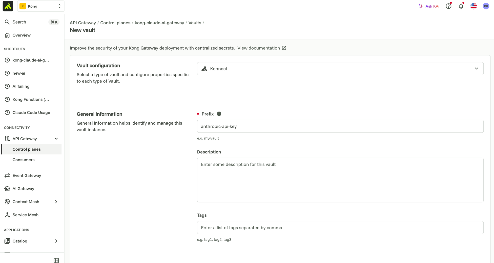
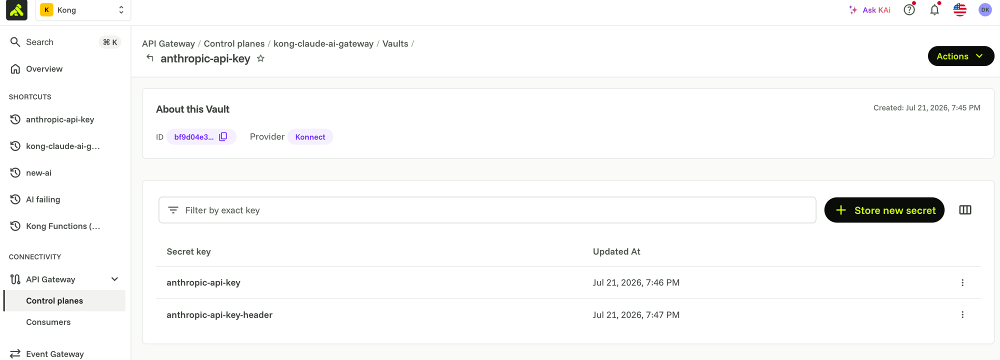
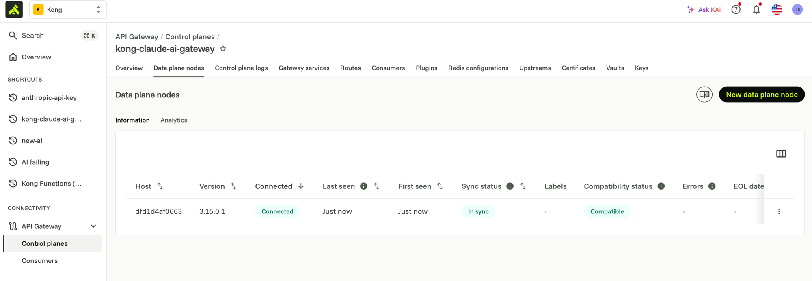

# 00 — Prerequisites (one-time setup)

Do this once. Everything from module 1 onward layers on top of this same
running stack — you don't tear anything down between modules.

## 1. Konnect account + token

1. Sign in to [Konnect](https://cloud.konghq.com).
2. Generate a Personal Access Token: **Gateway Manager → your org → Personal
   Access Tokens → Generate Token**.
3. Copy `.env.example` to `.env` and fill in:
   - `KONNECT_TOKEN` — the token above
   - `KONNECT_REGION` — e.g. `us`, `eu`, `au` (matches the region in your
     Konnect URL, `https://<region>.cloud.konghq.com`)
   - `KONNECT_CONTROL_PLANE` — name for the CP this lab will create, e.g.
     `claude-e2e`

`.env` is git-ignored — never commit it.

## 2. Docker + Docker Compose

Install Docker Desktop (or an equivalent) so `docker compose` works locally.

## 3. `deck` CLI

Install [decK](https://docs.konghq.com/deck/latest/) and confirm it's on
your `PATH`: `deck version`.

## 4. Anthropic API key

Get an API key from the [Anthropic Console](https://console.anthropic.com).
This is the *upstream* credential Kong uses to actually call Anthropic — it
is never stored in a `kong/*.yaml` file. It's seeded once into a Konnect
vault (step 6) and referenced from config via `{vault://...}`.

## 5. Bootstrap the control plane + data plane certs

```bash
scripts/00-bootstrap-konnect.sh
```

This creates (or verifies) your Konnect control plane and prints the
`KONNECT_CP_ENDPOINT` / `KONNECT_TELEMETRY_ENDPOINT` values to paste into
`.env`.

The script prints the remaining steps as manual instructions, including
generating a data plane client certificate: **API Gateway → Control planes
→ your control plane → Data plane nodes → New data plane node** — that page
always shows
the exact, current values for your account, and lets you generate/download a
cert/key pair. Save them as `tls.crt` / `tls.key` under the directory named
by `CERTS_DIR` in `.env` (defaults to `./certs/`, git-ignored), and
`chmod 600` the key. `docker-compose.yml` mounts `CERTS_DIR` read-only into
the `kong-dp` container.

## 6. Create the Konnect vault for the Anthropic key

The bootstrap script prints this as a manual step because vault setup is a
few clicks in the UI:

1. **API Gateway → Control planes → your control plane → Vaults → New vault**
2. Vault configuration: **Konnect**
3. Prefix: `anthropic-api-key`

   

4. Open the vault you just created, and under its secrets list click
   **Store new secret** twice:
   - `anthropic-api-key` = your `ANTHROPIC_API_KEY`
   - `anthropic-api-key-header` = your `ANTHROPIC_API_KEY_HEADER` (the
     `"x-api-key: <key>"` form, header name included) — used by
     `request-transformer-advanced` on the `claude-models` service, which
     sets a raw header value rather than just the key

   

5. Copy the vault's ID (shown on its detail page, e.g. `bf9d04e3-...`)
   into `.env` as `KONG_VAULT_CONFIG_STORE_ID`

Every `kong/*.yaml` in this repo references these as
`{vault://anthropic-api-key/anthropic-api-key}` and
`{vault://anthropic-api-key/anthropic-api-key-header}` — the real key value
never appears in a file that gets committed.

The vault's config store ID itself (account-specific, not a secret) is read
into the state file via decK's native templating —
`${{ env "DECK_VAULT_CONFIG_STORE_ID" }}` — rather than being hardcoded.
Every module doc's "Apply it" section has a copy-pasteable block that
sources `.env` and exports the `DECK_*` vars that module's `kong/*.yaml`
needs directly — there's no wrapper script for this, just run `deck`
yourself with those exported.

## 7. Bring up the local stack

```bash
docker compose up -d
```

Starts just the Kong data plane (connects to your Konnect control plane
over mTLS) — enough for modules 1-5. Modules 6-7 add optional overlays for
local Prometheus/Grafana/Jaeger (module 6's Konnect dashboard needs none of
this — see its own doc):

```bash
docker compose -f docker-compose.yml \
  -f docker-compose.observability.yml \
  -f docker-compose.otel.yml \
  up -d
```

**What you should see:** within a few seconds of `docker compose up -d`,
your `kong-dp` container connects to Konnect over mTLS. Confirm it in the
UI at **API Gateway → Control planes → your control plane → Data plane
nodes** — a node should appear with **Connected** / **In sync** /
**Compatible** status:



If it doesn't show up, double check `KONNECT_CP_ENDPOINT` /
`KONNECT_TELEMETRY_ENDPOINT` in `.env` (step 5) and that `certs/tls.crt` /
`tls.key` exist and match what Konnect issued (step 5).

## 8. Claude Desktop app

Install [Claude Desktop](https://claude.ai/download). Module-specific
pointing instructions live in `claude-desktop/README.md` — the settings only
change when auth semantics change (module 1 → no auth, module 2 → API key,
module 3+ → OIDC).

## 9. Okta (needed starting module 3)

Bring your own Okta tenant with admin access to create an OIDC app
registration. Not needed until module 3 — nothing to do here yet.

---

Once steps 1-8 are done, move on to
[`docs/01-general-proxying.md`](01-general-proxying.md).
