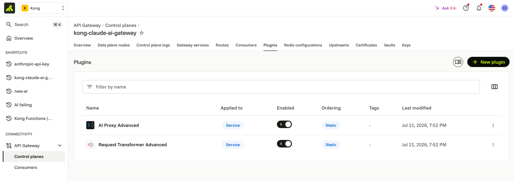
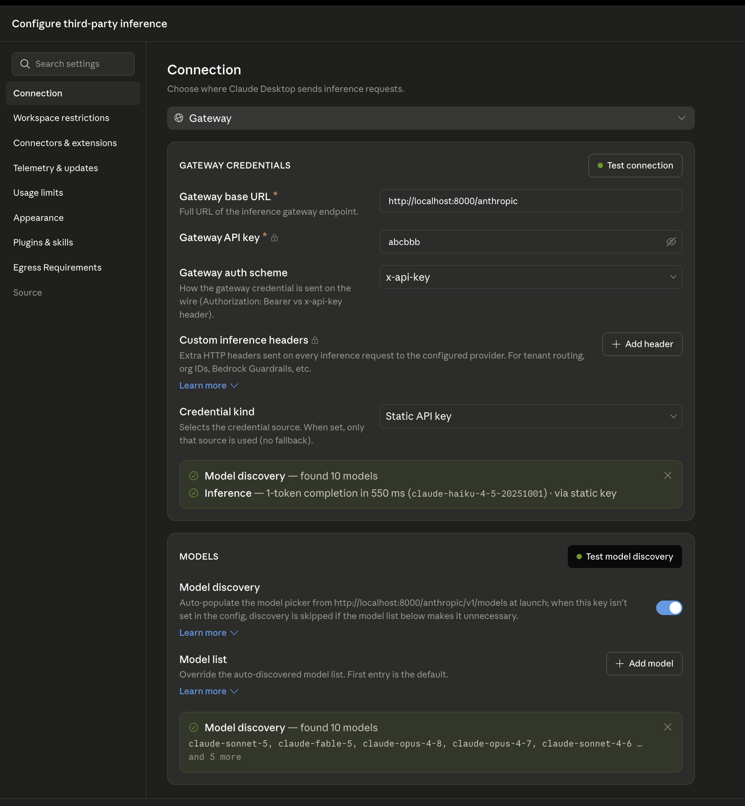

# 01 — General proxying & setup

## What this adds

A Kong Service + Route in front of `api.anthropic.com`, fronted by the
`ai-proxy-advanced` plugin configured for Anthropic's chat completion API
(`llm/v1/chat`), plus a second route that proxies `GET /v1/models`. No
auth is enforced at Kong yet — this module only proves Claude Desktop can
complete a chat *through* the gateway at all, with Kong (not the client)
holding the real Anthropic credential.

Why it matters: every later module builds on this same route. Getting a
clean, working proxy path first means auth/limits/observability changes in
modules 2-8 are additive, not debugged alongside basic connectivity.

## What's in `kong/01-general-proxying.yaml`

- a `claude-chat` service/route (`/anthropic`) with the `ai-proxy-advanced`
  plugin, targeting the `anthropic` provider, `llm/v1/chat` route type, with
  the upstream `x-api-key` pulled from the Konnect vault (never inline).
  `logging.log_payloads` / `logging.log_statistics` are on so you have real
  request/response data to look at once the observability modules land
- a `claude-models` service/route (`/anthropic/v1/models`) that proxies
  Anthropic's models list endpoint, using `request-transformer-advanced` to
  inject the same vaulted key as a header
- a `konnect` vault entry pointing at the `anthropic-api-key` prefix

The file uses decK's native `${{ env "DECK_..." }}` templating for the two
account-specific values: `_konnect.control_plane_name` and the vault's
`config_store_id`.

## Apply it

Load the values from `.env` and apply directly with `deck`:

```bash
set -a; source .env; set +a
export DECK_KONNECT_TOKEN="$KONNECT_TOKEN"
export DECK_KONNECT_CONTROL_PLANE_NAME="$KONNECT_CONTROL_PLANE"
export DECK_VAULT_CONFIG_STORE_ID="$KONG_VAULT_CONFIG_STORE_ID"

deck gateway apply kong/01-general-proxying.yaml
```

If `KONNECT_REGION` isn't `us`, also set
`export DECK_KONNECT_ADDR="https://${KONNECT_REGION}.api.konghq.com"` before
running `deck`.

**What you should see:** in Konnect, **API Gateway → Control planes → your
control plane → Plugins** should list `AI Proxy Advanced` and `Request
Transformer Advanced`, both `Applied to: Service` and `Enabled`:



## Claude Desktop configuration

See [`claude-desktop/README.md`](../claude-desktop/README.md) — point the
custom base URL at `http://localhost:8000/anthropic`. No API key needed at
the Desktop app for this module; Kong injects it, so any placeholder value
in the **Gateway API key** field works (auth scheme `x-api-key`, credential
kind `Static API key`). **Test connection** should confirm both model
discovery and a real inference call succeeding through Kong:


