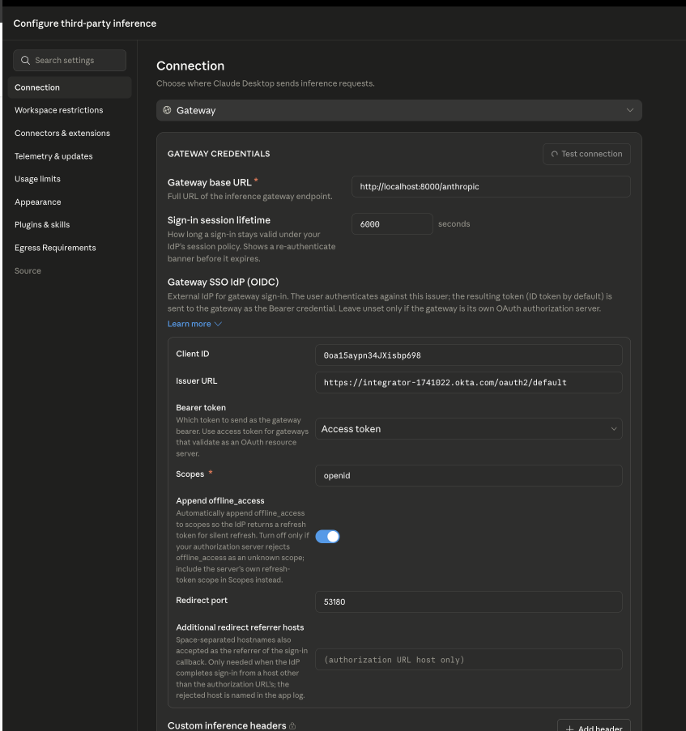
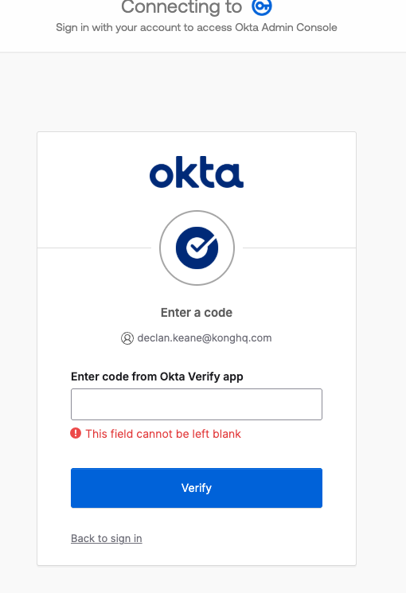
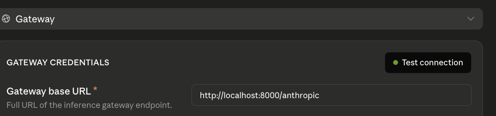

# 03 — OIDC + Okta

## What this adds

Replaces module 2's `key-auth` with Okta-backed OIDC. The `key-auth` plugin
and the `claude-desktop` Consumer are gone — Kong now authenticates callers
against your Okta org via the `openid-connect` plugin, per service.

Why it matters: this moves identity off a static Kong-issued key onto real
SSO. Modules 4-5 (per-user model limits, rate limiting) key off the identity
Okta establishes here.

Before applying this, do the one-time [Okta app setup](okta-setup.md).

## What's in `kong/03-oidc-okta.yaml`

Same `claude-chat` / `claude-models` services as module 2, minus `key-auth`
and `consumers`, plus an `openid-connect` plugin on each service:

- `issuer`, `client_id`, `client_secret` — your Okta app, from `.env`
- `redirect_uri` — every route Kong protects in this module
  (`/anthropic`, `/anthropic/v1/messages`, `/anthropic/v1/models`), must
  match what you registered in Okta
- `login_action: redirect` — unauthenticated requests get redirected to
  Okta's login page
- `auth_methods: [authorization_code, session, bearer]` — browser login
  flow, a Kong session cookie after that, or a bearer token if you already
  have one from Okta
- `session_secret`, `cache_tokens_salt` — both from `.env`, kept stable so
  re-applying this file doesn't invalidate active sessions or rotate the
  token cache key (decK refuses to sync `openid-connect` without an
  explicit `cache_tokens_salt`, for exactly that reason)
- `ssl_verify: true`, plus `redis.ssl_verify: true` and
  `cluster_cache_redis.ssl_verify: true` (even though Redis isn't used
  here) — the plugin defaults all three to `false`; this control plane's
  data plane has a global `tls_certificate_verify` policy that rejects
  *any* `ssl_verify` field left disabled, used or not, so all three must
  be set explicitly

Everything else on the plugin (PKCE, DPoP, Redis session backends, etc.) is
left at Kong's defaults.

## Apply it

```bash
set -a; source .env; set +a
export DECK_KONNECT_TOKEN="$KONNECT_TOKEN"
export DECK_KONNECT_CONTROL_PLANE_NAME="$KONNECT_CONTROL_PLANE"
export DECK_VAULT_CONFIG_STORE_ID="$KONG_VAULT_CONFIG_STORE_ID"
export DECK_OKTA_ISSUER="$OKTA_ISSUER"
export DECK_OKTA_CLIENT_ID="$OKTA_CLIENT_ID"
export DECK_OKTA_CLIENT_SECRET="$OKTA_CLIENT_SECRET"
export DECK_OIDC_SESSION_SECRET="$OIDC_SESSION_SECRET"
export DECK_OIDC_CACHE_TOKENS_SALT="$OIDC_CACHE_TOKENS_SALT"

deck gateway apply kong/03-oidc-okta.yaml
```

If `KONNECT_REGION` isn't `us`, also set
`export DECK_KONNECT_ADDR="https://${KONNECT_REGION}.api.konghq.com"` before
running `deck`.

## Claude Desktop configuration

See [`claude-desktop/README.md`](../claude-desktop/README.md#module-3--oidc--okta)
— Desktop has a native OIDC gateway connection type (separate from the
static API key field used in modules 1-2) that drives Okta's login itself
via a local loopback callback on port `53180`, which is why that port is
one of the registered redirect URIs in `docs/okta-setup.md`.

Fill in the **Gateway SSO IdP (OIDC)** fields and click **Test connection**:



Desktop opens your browser and redirects to Okta to sign in (including MFA,
if your org requires it):



Once you complete sign-in, **Test connection** shows green:



---

Next: module 4, per-user model access limits (not yet built — see
`REPO_PLAN.md` for the roadmap).
