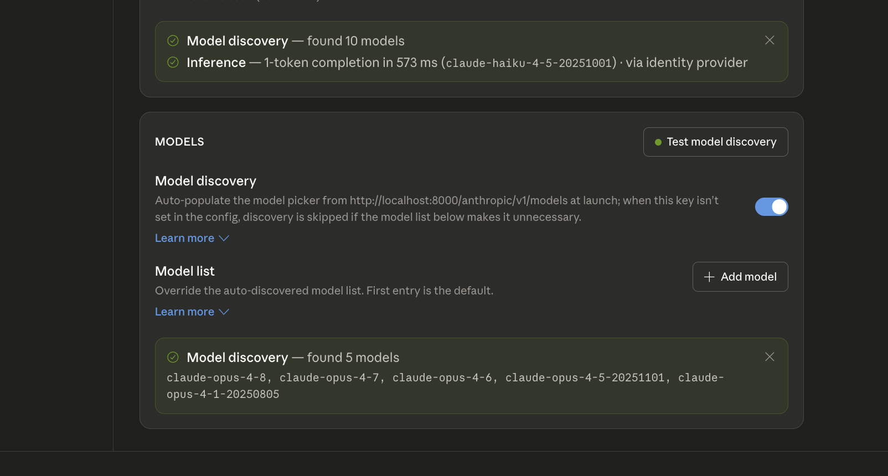
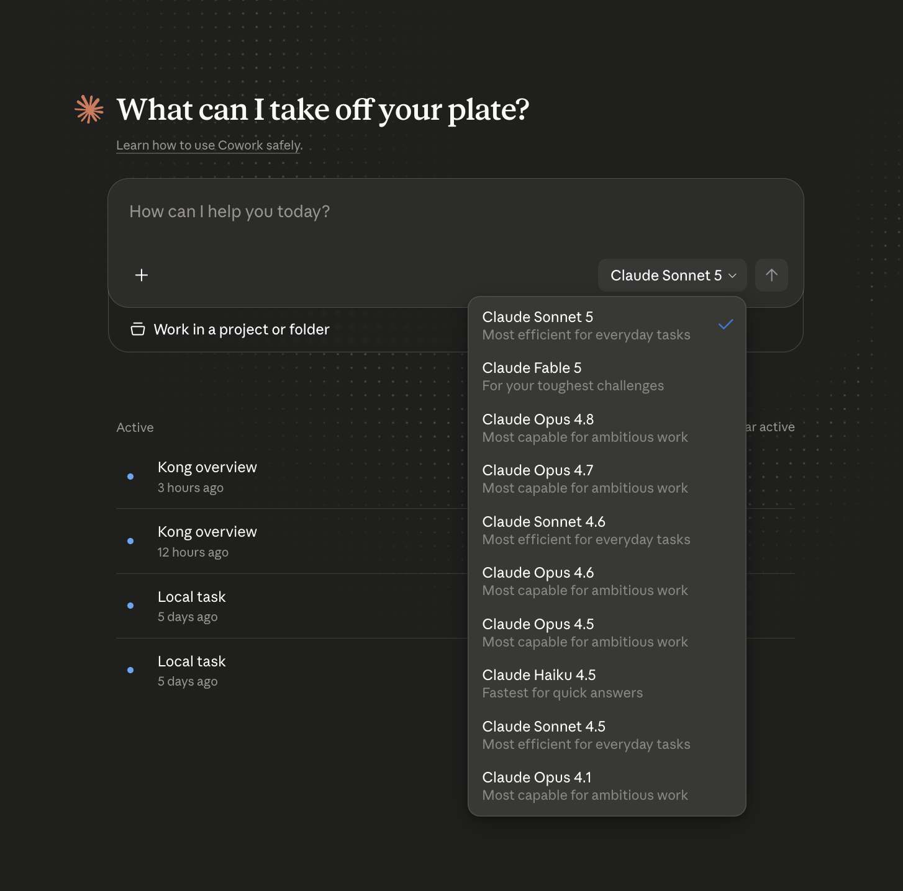

# 04 — Per-user model access limits

## What this adds

Everything from module 3, plus team-based filtering of the `GET
/anthropic/v1/models` listing: which models a caller sees depends on a
`team` claim in their Okta access token.

Why it matters: modules 1-3 gave every authenticated caller the same view.
This is the first module where two different identities get two different
outcomes from the gateway, using a claim that's already inside the token
Okta issued in module 3 — no separate authorization system needed.

## What's in the access token

The `team` claim comes back as a plain custom claim on the Okta access
token, alongside the standard OIDC ones. Decoded, a `kong-standard` user's
token looks like:

```json
{
  "ver": 1,
  "jti": "AT.BD_sfLzShWmrnaHt3kX6CI0hhehOMyuaYOWK4EegfsQ",
  "iss": "https://integrator-1741022.okta.com/oauth2/default",
  "aud": "api://default",
  "iat": 1784432546,
  "exp": 1784436146,
  "cid": "0oa15d4jr5oIR5Eel698",
  "uid": "00u15c6ukel5jXEd0698",
  "scp": ["openid"],
  "auth_time": 1784432545,
  "sub": "declan.keane+standard@konghq.com",
  "company-groups": ["Everyone", "kong-standard"],
  "clientId": "0oa15d4jr5oIR5Eel698",
  "team": "kong-standard"
}
```

`"team": "kong-standard"` is the one field this whole module cares about —
it's what the `pre-function` plugin reads (see below) and what
`kong/05-consumer-rate-limiting.yaml`'s `consumer_by`/`consumer_claims`
later maps to a Consumer. `company-groups` shows where it likely comes
from on the Okta side (a group membership mapped into a claim by the
authorization server), but Kong only ever looks at `team` directly — how
you populate that claim in your own Okta org is up to your claims mapping.

## What's in `kong/04-per-user-model-limits.yaml`

Same `claude-chat` / `claude-models` services and `openid-connect` config as
module 3, plus:

- a global `pre-function` plugin (`rewrite` phase, runs before routing) that
  pulls the bearer token out of the `Authorization` header, decodes it as a
  JWT, and copies the `${TEAM_CLAIM_NAME}` claim (default `team`) into a
  `${TEAM_HEADER_NAME}` request header (default `Team`) — configurable via
  `.env`, not hardcoded in the Lua. It always clears any client-supplied
  value of that header first, so a caller can't spoof their own team.
- two new routes on `claude-models`, matched on `paths: [/anthropic/v1/models]`
  plus a `headers: {team: [...]}` condition, each terminated by a
  `request-termination` plugin returning a static, team-specific model list:
  - `team: kong-premium` → all 10 models in the catalog, full detail
    (capabilities, context window, etc.)
  - `team: kong-standard` → 5 models only — specifically the 5 most
    expensive (Opus-tier) ones, per the pricing table in
    [`docs/05-consumer-rate-limiting.md`](05-consumer-rate-limiting.md)
  - the original `claude-models-route` (no header condition) stays as a
    fallback for any other/missing team, proxying the real Anthropic
    `/v1/models` response like module 3 did

Kong's router picks the more specific (path + header) route automatically
when a team matches, so route order in the file doesn't matter.

This only filters the models *listing*. It doesn't stop a standard-tier
caller from still calling a premium model in an actual chat completion via
`ai-proxy-advanced` — that enforcement isn't built here, call it out if you
want it added.

## Apply it

```bash
set -a; source .env; set +a
export DECK_KONNECT_TOKEN="$KONNECT_TOKEN"
export DECK_KONNECT_CONTROL_PLANE_NAME="$KONNECT_CONTROL_PLANE"
export DECK_VAULT_CONFIG_STORE_ID="$KONG_VAULT_CONFIG_STORE_ID"
export DECK_OKTA_ISSUER="$OKTA_ISSUER"
export DECK_OKTA_CLIENT_ID="$OKTA_CLIENT_ID"
export DECK_OKTA_CLIENT_SECRET="$OKTA_CLIENT_SECRET"
export DECK_OIDC_SESSION_SECRET="$OIDC_SESSION_SECRET"
export DECK_OIDC_CACHE_TOKENS_SALT="$OIDC_CACHE_TOKENS_SALT"
export DECK_TEAM_CLAIM_NAME="$TEAM_CLAIM_NAME"
export DECK_TEAM_HEADER_NAME="$TEAM_HEADER_NAME"

deck gateway apply kong/04-per-user-model-limits.yaml
```

If `KONNECT_REGION` isn't `us`, also set
`export DECK_KONNECT_ADDR="https://${KONNECT_REGION}.api.konghq.com"` before
running `deck`.

## Verify

Log into Claude Desktop (module 3's OIDC gateway connection) as a user
whose token carries `team: kong-standard` — model discovery finds exactly
the 5 Opus-tier models:



Log in as a `kong-premium` user instead, and the chat model picker shows
all 10:



A token with no `team` claim (or a team that isn't one of the two above)
falls through to the real Anthropic model list instead of either filtered
set.
