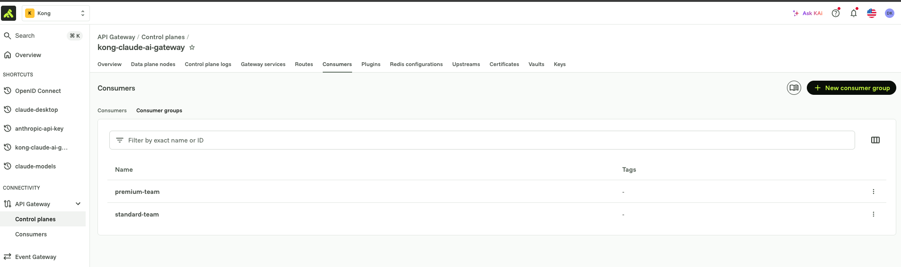
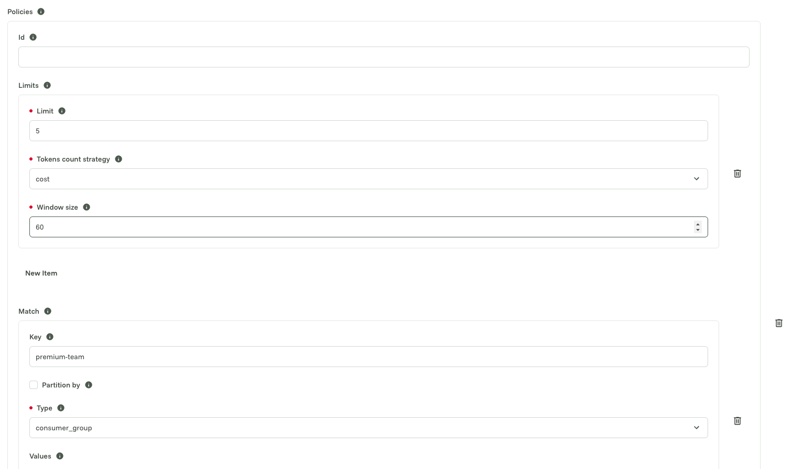
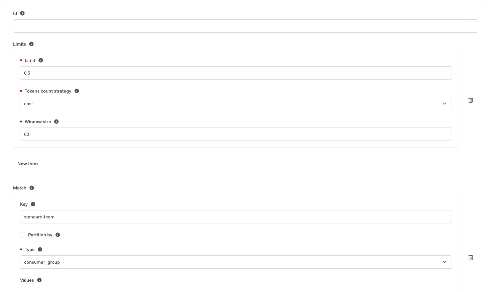

# 05 — Consumer-based rate limiting, by cost, per model

## What this adds

Everything from module 4, plus cost-based rate limiting scoped to two
Consumer Groups (`premium-team`, `standard-team`), driven by the same
`team` claim already used for module 4's model-listing routing.

Why it matters: modules 1-4 controlled *who* can call the gateway and
*which models they can see*. This module controls *how much they can
spend* — enforced per team, calculated from real per-model token pricing
rather than a flat request-count or provider-wide token limit.

## What's in `kong/05-consumer-rate-limiting.yaml`

Same `claude-chat` / `claude-models` services as module 4, plus:

- two `consumers` (`team-kong-premium`, `team-kong-standard`), each with a
  `custom_id` matching one of the `team` claim values (`kong-premium` /
  `kong-standard`), and each a member of a matching `consumer_groups` entry
- `openid-connect` on `claude-chat` gets `consumer_claims` (mapped to the
  same claim as `TEAM_CLAIM_NAME`) and `consumer_by: [custom_id]`, so Kong
  resolves an authenticated request to one of the two Consumers above by
  matching the token's `team` claim against `custom_id`. `consumer_optional:
  true` — a caller with no/unrecognized team still authenticates fine, they
  just won't match either Consumer Group, so no cost limit applies to them
- `ai-proxy-advanced`'s single dynamic target is replaced with one target
  per priced model, each pinned via `model.model_alias` (must match the
  `model` field the client sends) and carrying `model.options.input_cost` /
  `output_cost` in USD per 1M tokens. A final target with no `model_alias`
  is kept as a fallback so any other model still gets proxied dynamically,
  just without cost tracking
- `ai-rate-limiting-advanced` on `claude-chat`, in `policies` mode: one
  policy per Consumer Group (`match.type: consumer_group`), each with a
  `limit` in **USD per 60s window** (`tokens_count_strategy: cost`)

## Pricing used (illustrative)

| Model | model_alias | input $/1M tok | output $/1M tok | Source |
|---|---|---|---|---|
| Claude Opus 4.8 | `claude-opus-4-8` | 15 | 75 | Opus-tier rate, extrapolated |
| Claude Sonnet 5 | `claude-sonnet-5` | 3 | 15 | Sonnet-tier rate, extrapolated |
| Claude Fable 5 | `claude-fable-5` | 1 | 5 | Lightweight-tier rate, extrapolated |
| Claude Haiku 4.5 | `claude-haiku-4-5-20251001` | 1 | 5 | Haiku-tier rate, extrapolated |

The fictional/future models (Opus 4.8, Sonnet 5, Fable 5) don't have real
published prices — these are extrapolated from Anthropic's actual public
per-tier pricing pattern (Opus ≈ $15/$75, Sonnet ≈ $3/$15, lightweight ≈
$1/$5 per 1M input/output tokens). Check
[anthropic.com/pricing](https://www.anthropic.com/pricing) and update
`kong/05-consumer-rate-limiting.yaml` if you want exact current rates.

## Rate limits used (illustrative)

- `premium-team`: **$5.00 per 60s window**
- `standard-team`: **$0.50 per 60s window**

Adjust the `limit` values in the `ai-rate-limiting-advanced` policies to
whatever budget makes sense for your test.

These are the two Consumer Groups the policies match against (**API
Gateway → Control planes → your control plane → Consumers → Consumer
groups**):



And the two policies themselves, on `ai-rate-limiting-advanced` (each one's
`Match → Key` is the consumer group name above, `Type: consumer_group`):





## Apply it

```bash
set -a; source .env; set +a
export DECK_KONNECT_TOKEN="$KONNECT_TOKEN"
export DECK_KONNECT_CONTROL_PLANE_NAME="$KONNECT_CONTROL_PLANE"
export DECK_VAULT_CONFIG_STORE_ID="$KONG_VAULT_CONFIG_STORE_ID"
export DECK_OKTA_ISSUER="$OKTA_ISSUER"
export DECK_OKTA_CLIENT_ID="$OKTA_CLIENT_ID"
export DECK_OKTA_CLIENT_SECRET="$OKTA_CLIENT_SECRET"
export DECK_OIDC_SESSION_SECRET="$OIDC_SESSION_SECRET"
export DECK_OIDC_CACHE_TOKENS_SALT="$OIDC_CACHE_TOKENS_SALT"
export DECK_TEAM_CLAIM_NAME="$TEAM_CLAIM_NAME"
export DECK_TEAM_HEADER_NAME="$TEAM_HEADER_NAME"

deck gateway apply kong/05-consumer-rate-limiting.yaml
```

If `KONNECT_REGION` isn't `us`, also set
`export DECK_KONNECT_ADDR="https://${KONNECT_REGION}.api.konghq.com"` before
running `deck`.

## Verify

Log into Claude Desktop (module 3's OIDC gateway connection) as a
`kong-standard` user — cheap budget, easiest to exhaust for testing — and
send several chat messages in Claude Chat within 60 seconds. Once
accumulated cost crosses $0.50, you should get rate-limited by
`ai-rate-limiting-advanced` before the request reaches Anthropic. Log in as
a `kong-premium` user instead and repeat the same burst — 10x the budget
means it should keep succeeding.
