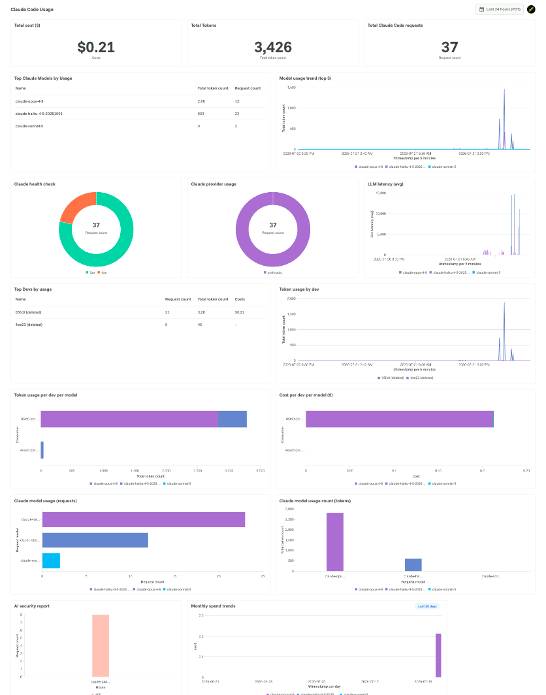

# 06 — Kong observability (Konnect built-in dashboarding)

## What this adds

A **Konnect Advanced Analytics custom dashboard** ("Claude Code Usage")
built entirely on Konnect's own `llm_usage` datasource — no Grafana,
no decK, no local infra. It covers cost, tokens, request counts,
per-model and per-consumer breakdowns, latency, and a security report.
View it in the Konnect UI under **Analytics → Dashboards**.



This is the zero-infrastructure option: Konnect already collects this
telemetry from every connected data plane. For an external, Grafana-based
alternative, see [docs/07-opentelemetry.md](07-opentelemetry.md) — the two
modules are independent and don't depend on each other.

## How this module is applied

A plain JSON file,
[`observability/claude-code-usage-dashboard.json`](../observability/claude-code-usage-dashboard.json),
is pushed to the Konnect Admin API by
[`scripts/push-konnect-dashboard.sh`](../scripts/push-konnect-dashboard.sh):

```bash
./scripts/push-konnect-dashboard.sh
```

The script is idempotent — it updates the "Claude Code Usage" dashboard if
it already exists, or creates it if not. It also rewrites the checked-in
file's `preset_filters` route reference to your actual `claude-chat-route`
ID at push time, so the repo doesn't hardcode an environment-specific UUID.

**Note:** the dashboard uses a full-replace API (no partial update). If you
customize it further in the Konnect UI, re-running this script will
overwrite those changes.

## Verify

Open the Konnect UI → **Analytics → Dashboards → Claude Code Usage**.
Tiles populate once a request completes through `ai-proxy-advanced` to
Anthropic — you need a real authenticated chat completion (module 3's Okta
login, then a chat through `/anthropic`), not just an unauthenticated
redirect.

---

Next: module 7, OpenTelemetry tracing + external (Grafana) observability.
