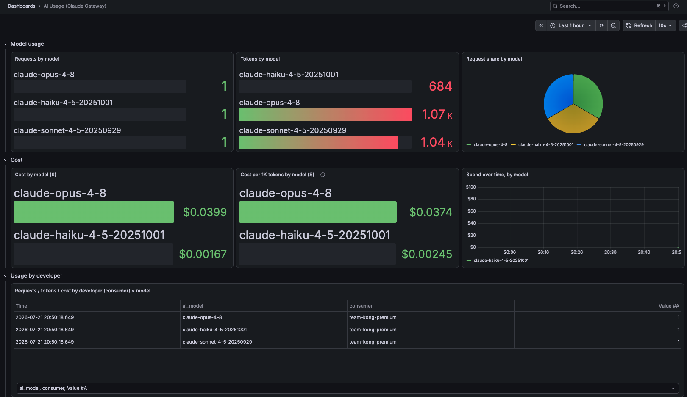

# 07 — OpenTelemetry tracing + external (Grafana) observability

## What this adds

Everything from module 5 (module 6 isn't in `kong/*.yaml` — see its own
doc — and is entirely independent of this one), plus:

- A global `opentelemetry` plugin shipping both traces (→ otel-collector →
  Jaeger) and metrics (→ otel-collector → Prometheus format) for every
  request.
- The global `prometheus` plugin (applied via Admin API, like module 6 —
  see below), feeding a local Prometheus + Grafana stack with a
  purpose-built **AI Usage** dashboard: model usage, token usage, cost per
  model/token, usage by developer, status codes/error rate, latency.

Why it matters: module 6's Konnect dashboard is great for a
no-infrastructure view, but it's Konnect-hosted and fixed to Konnect's own
tile types. This module is the "bring your own tooling" option — full
control over the dashboard, plus the other thing Konnect's dashboard can't
give you: a full per-request span breakdown (which plugin took how long, in
what order) for debugging a *specific* slow or broken request, correlated
across Desktop → Kong → Anthropic.

## Docker Compose is now three files

```
docker-compose.yml                 # kong-dp only
docker-compose.observability.yml   # module 7: prometheus + grafana
docker-compose.otel.yml            # module 7: jaeger + otel-collector
```

Layer whichever you need:

```bash
docker compose -f docker-compose.yml \
  -f docker-compose.observability.yml \
  -f docker-compose.otel.yml \
  up -d
```

(Metrics-only Grafana dashboards for this module read from Prometheus, so
you want the observability overlay running too, not just otel.)

## Three non-obvious gates this needed (all in `docker-compose.otel.yml`)

None of these are decK/plugin config — they're `kong-dp` process-level
settings, invisible from the plugin schema alone:

1. **`KONG_OPENTELEMETRY_TRACING: "all"`** — tracing is entirely disabled
   (`off`) by default at the Kong process level, independent of whether the
   `opentelemetry` plugin is configured.
2. **`KONG_TRACING_INSTRUMENTATIONS: "all"`** — controls which internal
   Kong operations (router, plugin phases, balancer, etc.) actually get
   instrumented into spans. Also `off` by default.
3. **`KONG_OPENTELEMETRY_TRACING_SAMPLING_RATE: "1"`** — this is the one
   that actually cost the most time to find. It's a *third*, separate
   sampling control from the plugin's own `config.sampling_rate`, and
   defaults to `0.01` (1%). With `sampling_strategy:
   parent_drop_probability_fallback` (the plugin default), Kong's own
   internally-instrumented root span acts as a "parent" — and its
   sampled=false verdict (99% of the time, at the 1% default) wins over the
   plugin's 100% `config.sampling_rate` fallback. Spans still got *counted*
   in the debug logs (`total spans in current request: 9`) even while being
   silently dropped before export — the counting and the sampling decision
   are separate. Without this set to `1`, only ~1% of requests would ever
   reach Jaeger, which looks indistinguishable from "traces are completely
   broken" during quick testing.

Also fixed in `observability/otel-collector-config.yaml`: newer
`opentelemetry-collector-contrib` images default the OTLP receiver to
`127.0.0.1`, not `0.0.0.0` — unreachable from the separate `kong-dp`
container. Both `grpc`/`http` protocols now explicitly bind `0.0.0.0`.

## What's in `kong/07-opentelemetry.yaml`

Same as module 5, plus a global `opentelemetry` plugin:

- `traces_endpoint: http://otel-collector:4318/v1/traces`
- `sampling_rate: 1` (plugin-level — see gate #3 above for why this alone
  wasn't sufficient)
- `queue: {max_batch_size: 1, max_coalescing_delay: 1}` plus the deprecated
  `batch_span_count`/`batch_flush_delay` set to `1` too, so spans flush
  immediately rather than sitting in a batch — fine for this lab's traffic
  volume, not what you'd want in production
- `metrics.endpoint: http://otel-collector:4318/v1/metrics` with
  `enable_request_metrics`, `enable_latency_metrics`,
  `enable_bandwidth_metrics`, `enable_ai_metrics` all on

## otel-collector: two pipelines

`observability/otel-collector-config.yaml` fans the same OTLP input into
two outputs:

- **traces** → `otlp` exporter → `jaeger:4317`
- **metrics** → `prometheus` exporter → `:8889/metrics`, which
  `observability/prometheus.yml` scrapes as a second job (`otel-collector`),
  into the same Prometheus the `prometheus` plugin feeds

## Grafana: two dashboards + a Jaeger datasource

- **`observability/grafana/dashboards/ai-usage.json`** (the main one) —
  model usage (requests/tokens/cost by `ai_model`), cost per 1K tokens,
  spend over time, a table of requests/tokens/cost by consumer ("developer")
  × model, status codes, error rate %, and request latency percentiles.
  Sourced from the `prometheus` plugin's `ai_metrics` (`kong_ai_llm_*`)
  and standard request metrics — deliberately *not* Kong's generic
  community-published dashboard (grafana.com/dashboards/21162), which mixes
  in a lot of panels (caching, DB vector, generic nginx/upstream health)
  that don't apply to this gateway's setup.
- `observability/grafana/dashboards/opentelemetry.json` — request
  rate/status codes, `kong_latency_total_seconds` and
  `kong_latency_internal_seconds` percentiles, request/response bandwidth,
  sourced from OTel data instead of the `prometheus` plugin (useful to
  cross-check the two pipelines agree)
- A `Jaeger` datasource is provisioned
  (`observability/grafana/provisioning/datasources/jaeger.yml`) if you want
  to build trace-search panels directly in Grafana; otherwise use the
  Jaeger UI directly

## Apply it

```bash
set -a; source .env; set +a
export DECK_KONNECT_TOKEN="$KONNECT_TOKEN"
export DECK_KONNECT_CONTROL_PLANE_NAME="$KONNECT_CONTROL_PLANE"
export DECK_VAULT_CONFIG_STORE_ID="$KONG_VAULT_CONFIG_STORE_ID"
export DECK_OKTA_ISSUER="$OKTA_ISSUER"
export DECK_OKTA_CLIENT_ID="$OKTA_CLIENT_ID"
export DECK_OKTA_CLIENT_SECRET="$OKTA_CLIENT_SECRET"
export DECK_OIDC_SESSION_SECRET="$OIDC_SESSION_SECRET"
export DECK_OIDC_CACHE_TOKENS_SALT="$OIDC_CACHE_TOKENS_SALT"
export DECK_TEAM_CLAIM_NAME="$TEAM_CLAIM_NAME"
export DECK_TEAM_HEADER_NAME="$TEAM_HEADER_NAME"

deck gateway apply kong/07-opentelemetry.yaml
./scripts/enable-prometheus-metrics.sh
```

If `KONNECT_REGION` isn't `us`, also set
`export DECK_KONNECT_ADDR="https://${KONNECT_REGION}.api.konghq.com"` before
running `deck`.

The second command is the same Admin-API-not-decK pattern as module 6 —
`prometheus` isn't a decK-managed plugin in this repo.

## Verify

```bash
curl -s -o /dev/null http://localhost:8000/anthropic
curl -s http://localhost:16686/api/services   # should include "kong"
```

Open `http://localhost:16686`, service `kong`, and pull a trace — you
should see a full span tree (`kong.rewrite.plugin.pre-function`,
`kong.router`, `kong.access.plugin.*`, per-plugin `header_filter` spans,
etc.).

After a few real chat completions through Claude Desktop (module 3's OIDC
connection), `http://localhost:3000/d/ai-usage` fills in end to end —
requests/tokens/cost by model, cost per 1K tokens, spend over time, and the
per-developer breakdown table:



OTel metrics dashboard: `http://localhost:3000/d/opentelemetry`.

---

Next: module 8, metering & billing integration (not yet built — see
`REPO_PLAN.md` for the roadmap).
