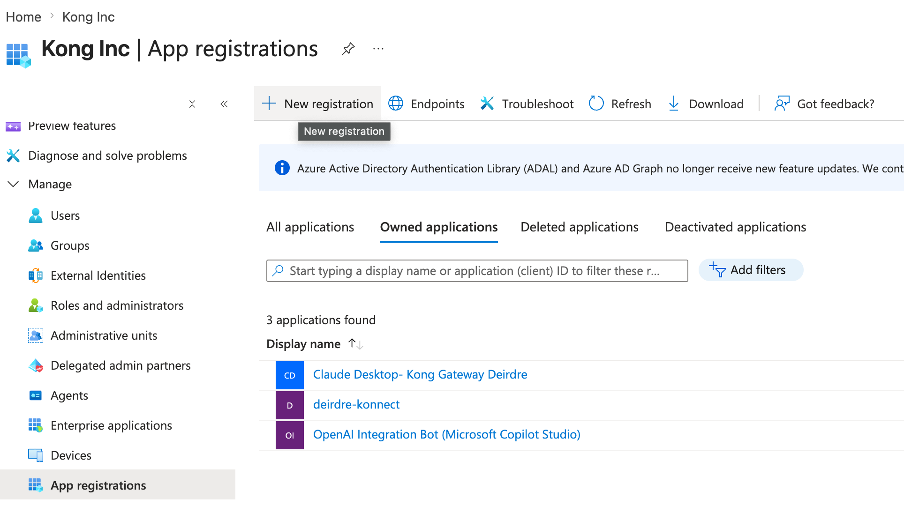
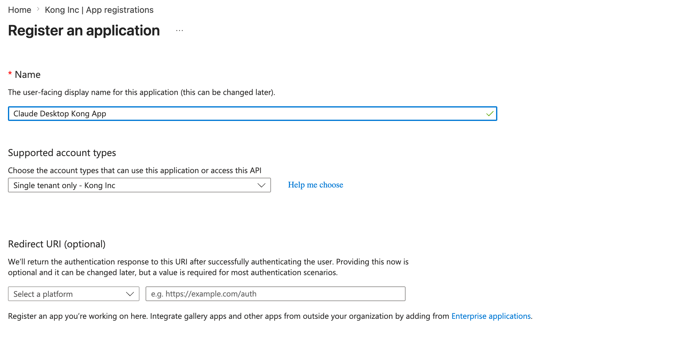
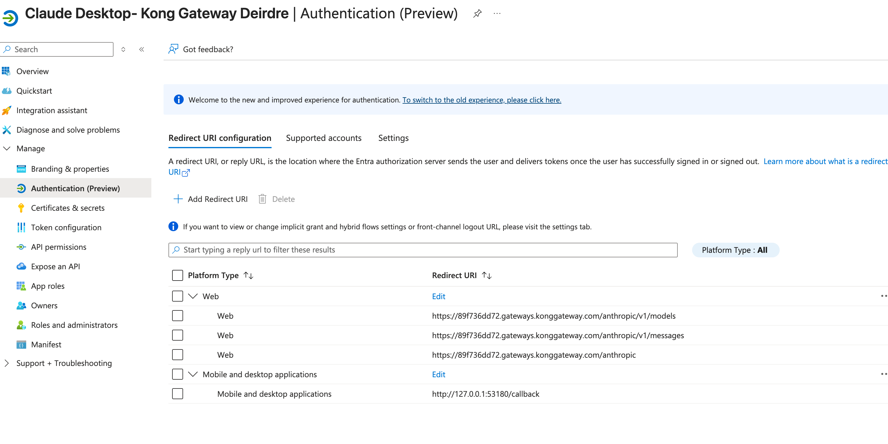
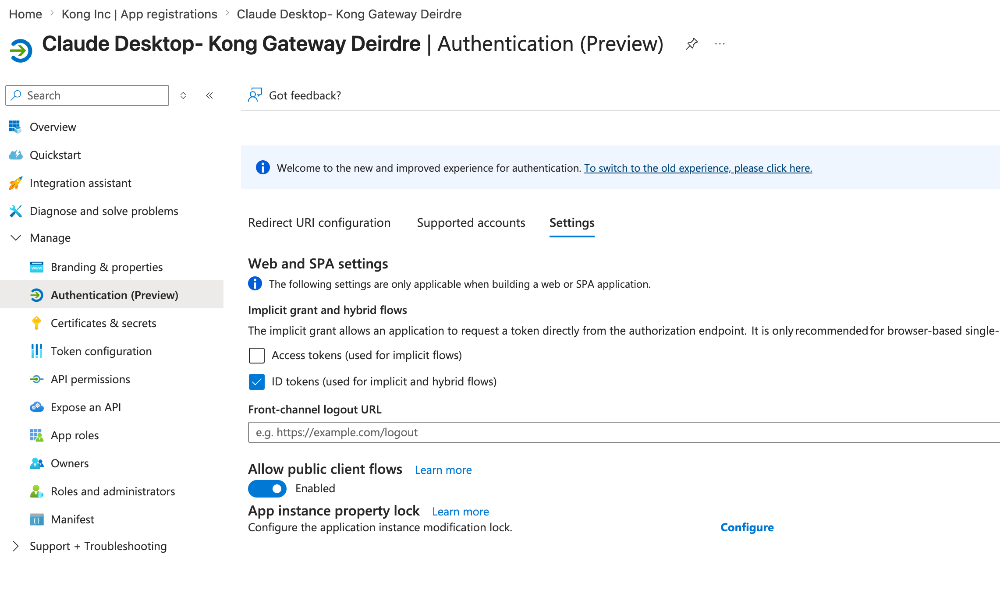
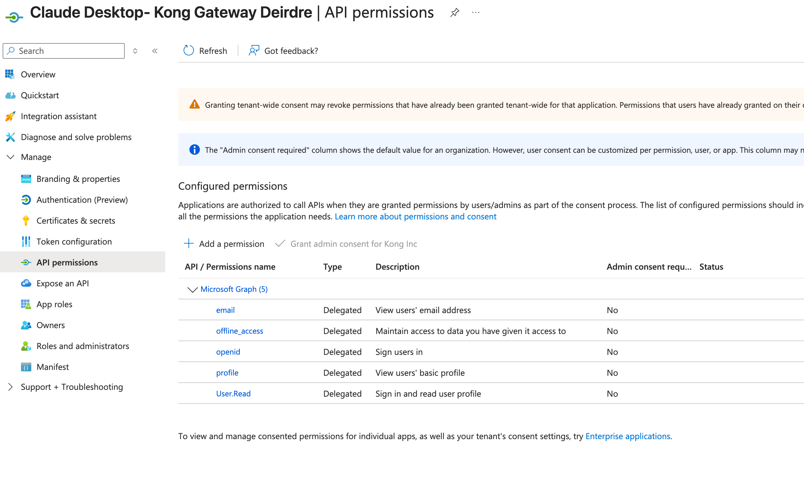
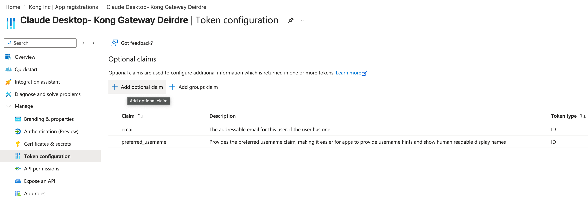

# Entra ID App Registration for Claude Desktop via Kong Gateway

## 1. Register the application
Entra admin center → **App registrations** → **New registration**
- Name: e.g. `Claude Desktop - Kong Gateway`
- Supported account types: **Accounts in this organizational directory only** (single tenant), unless multi-tenant is needed
- Redirect URI: leave blank at registration — added in the next step

## 2. Authentication (new "Authentication (Preview)" UI)
On the app → **Authentication**:
- **Redirect URI configuration** tab → **Add Redirect URI**
  - When prompted for URI type, add:
    - **Mobile and desktop applications** → `http://127.0.0.1:53180/callback`
    - **Web** → the three Kong server-side redirects:
      - `https://<your-gateway-url>/anthropic`
      - `https://<your-gateway-url>/anthropic/v1/messages`
      - `https://<your-gateway-url>/anthropic/v1/models`

- **Settings** tab:
  - **Allow public client flows** → **Yes** (enables PKCE without a real client secret)
  - **Implicit grant and hybrid flows** → check **ID tokens**

## 3. API permissions
The default registration only includes `Microsoft Graph → User.Read` (Delegated) — that's not sufficient for OIDC login.
- **API permissions** → **+ Add a permission** → **Microsoft Graph** → **Delegated permissions**
- Search and add individually:
  - `openid`
  - `email`
  - `offline_access` (needed for refresh tokens)
  - `profile` (search separately — not always bundled automatically in this UI)
- Leave `User.Read` in place (harmless, not required for OIDC)
- Click **Grant admin consent for <tenant>**
  - If it stays greyed out after the permissions are added and the page is refreshed, it's a role issue — you need **Global Administrator**, **Privileged Role Administrator**, or **Cloud Application Administrator** in this tenant. Otherwise, ask your Entra admin to grant it, or fall back to per-user consent for the POC.

## 4. Token Configuration (Optional)

Token configuration → Add optional claim → ID token → add email if it's not already present in issued tokens (common for guest/B2B accounts).

## 5. Collect values for `.env`

On the app's **General** tab:

| `.env` var | Where to find it |
|---|---|
| `ENTRA_CLIENT_ID` | "Application ID (clientID)" |
| `ENTRA_CLIENT_SECRET` | Put any dummy value in, e.g. `not-used-native-client` — PKCE is what actually secures the exchange, this string isn't checked |
| `ENTRA_ISSUER` | Your authorization server's discovery URL — for the default org authorization server this is `  https://login.microsoftonline.com/<TENANT_ID>/v2.0` |

Also generate a random `OIDC_SESSION_SECRET` (`openssl rand -hex 32`) — this
signs Kong's session cookie, it isn't an Okta value.