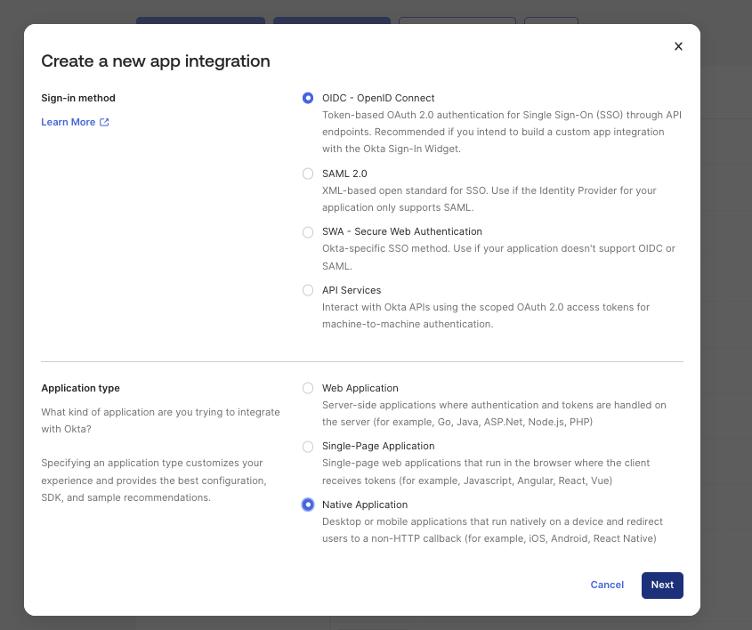
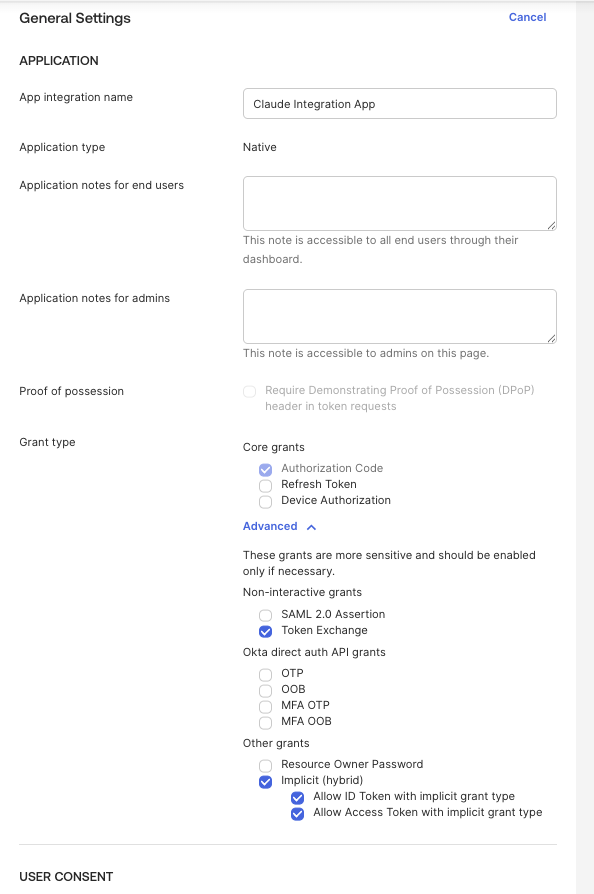
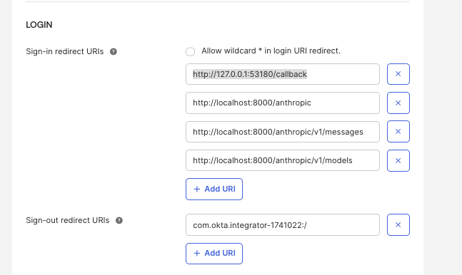

# Okta setup (for module 3 — OIDC)

One-time setup in your own Okta org. Bring-your-own-tenant — this repo
doesn't create the Okta app for you.

## 1. Create the app

1. Okta Admin Console → **Applications → Applications → Create App Integration**.
2. Sign-in method: **OIDC - OpenID Connect**.
3. Application type: **Native Application** (not Web Application).

   

   **Why Native, and why you don't need a client secret:** Okta treats
   "Native Application" as a *public client* under OAuth 2.0 (RFC 8252) —
   an app that runs entirely on a device outside your control, with no
   trusted server-side component holding credentials. A desktop/native
   client can't keep a secret confidential: anything shipped inside a
   distributed app or local config can be extracted by whoever has a copy
   of it. Instead of a static secret, native apps rely on **PKCE** (Proof
   Key for Code Exchange) — a fresh one-time verifier/challenge pair
   generated per login — to prove the app completing the token exchange is
   the same one that started it, with no shared secret required at all.
   Okta won't require (and typically won't even generate) a real
   `client_secret` for this application type — but Kong's `openid-connect`
   plugin requires the field to be non-empty regardless, so you'll put a
   dummy placeholder in `OKTA_CLIENT_SECRET` (see step 5). It isn't
   actually checked as a credential; PKCE is what secures the exchange.

4. Give it a name, e.g. "Claude Integration App".

## 2. Set the grant type

Still on the General Settings screen, under **Grant type**:



- Core grants: **Authorization Code** only — leave Refresh Token and
  Device Authorization unchecked.
- Advanced → Non-interactive grants: **Token Exchange**.
- Advanced → Other grants: **Implicit (hybrid)**, with both **Allow ID
  Token with implicit grant type** and **Allow Access Token with implicit
  grant type** checked.
- Leave everything else (SAML 2.0 Assertion, the Okta direct auth API
  grants, Resource Owner Password) unchecked.

## 3. Set the redirect URIs

Under **LOGIN → Sign-in redirect URIs**, add all four:

```
http://127.0.0.1:53180/callback
http://localhost:8000/anthropic
http://localhost:8000/anthropic/v1/messages
http://localhost:8000/anthropic/v1/models
```



`http://127.0.0.1:53180/callback` is a **loopback redirect** — the
native-app callback pattern from RFC 8252. When a native/desktop client
drives the login itself (rather than Kong handling the redirect
server-side), it opens the system browser for the user to log in, then
spins up a temporary local HTTP listener on an ephemeral port to catch
Okta's redirect carrying the authorization code — there's no embedded web
server otherwise available to receive it. Without this URI registered,
that flow gets rejected. The other three are Kong's own `redirect_uri`
values from `kong/03-oidc-okta.yaml` (the server-side `login_action:
redirect` flow) — you need both sets registered on this one Okta app since
this repo uses it for both flows.

These must match exactly (scheme, host, port, path) — Okta rejects the
callback otherwise.

Under **Sign-out redirect URIs**, Okta pre-fills a default based on your
org, e.g.:

```
com.okta.<your-okta-org-id>:/
```

This is a custom URI scheme, not an HTTP URL. It's how Okta hands control
back to a native app after logout: the OS routes `com.okta.<org>://...`
URIs to whichever app registered that scheme, instead of opening it in a
browser — the equivalent of the loopback callback above, but for sign-out
on platforms/flows that can't rely on a local HTTP listener. You can leave
Okta's pre-filled default as-is.

## 4. Assign users

Under **Assignments**, assign yourself (or a test group) to the app —
otherwise Okta will reject the login with a 403 even with a valid client.

## 5. Collect values for `.env`

On the app's **General** tab:

| `.env` var | Where to find it |
|---|---|
| `OKTA_CLIENT_ID` | "Client ID" |
| `OKTA_CLIENT_SECRET` | Okta won't issue a real one for a Native app (see step 1), but Kong's `openid-connect` plugin requires this field non-empty. Put any dummy value in, e.g. `not-used-native-client` — PKCE is what actually secures the exchange, this string isn't checked |
| `OKTA_ISSUER` | Your authorization server's discovery URL — for the default org authorization server this is `https://<your-okta-domain>/oauth2/default/.well-known/openid-configuration` (Security → API → Authorization Servers → `default` → Metadata URI) |

Also generate a random `OIDC_SESSION_SECRET` (`openssl rand -hex 32`) — this
signs Kong's session cookie, it isn't an Okta value.

Then continue with [`docs/03-oidc-okta.md`](03-oidc-okta.md) to apply the
Kong config.
