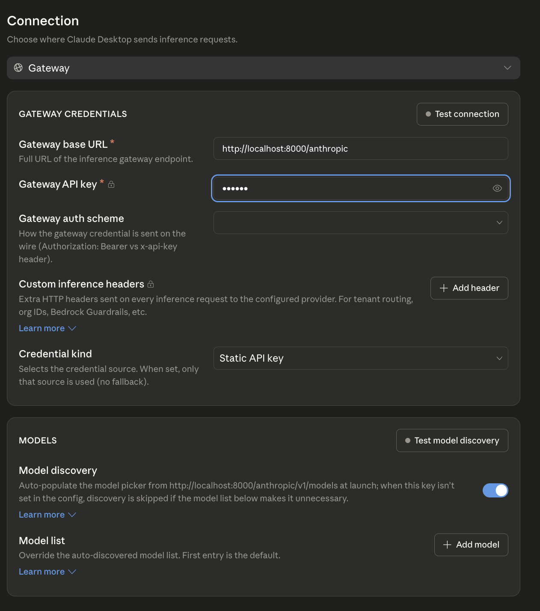
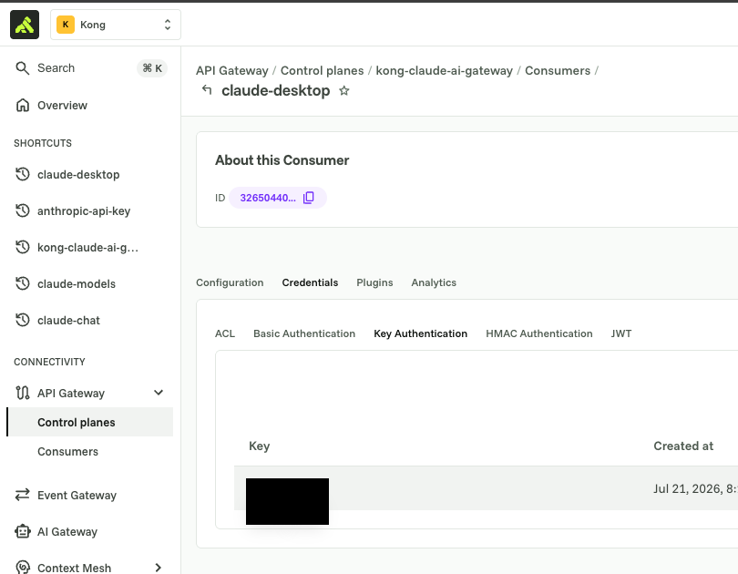
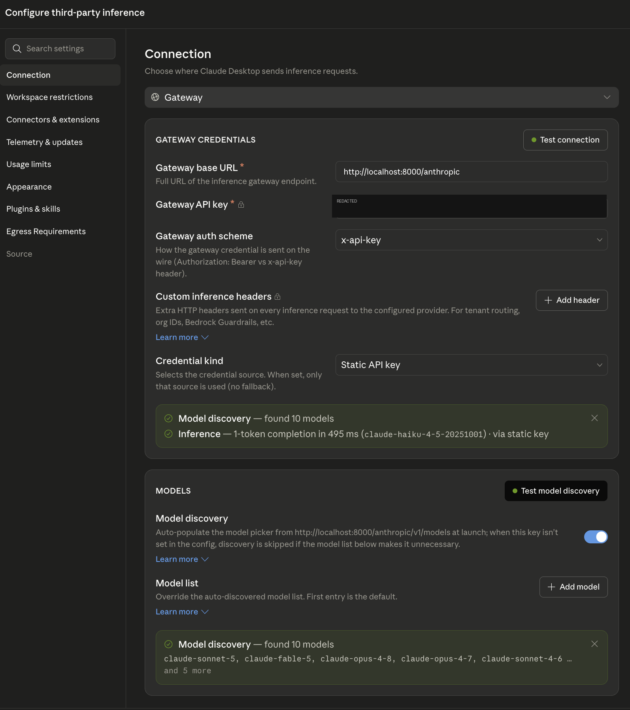
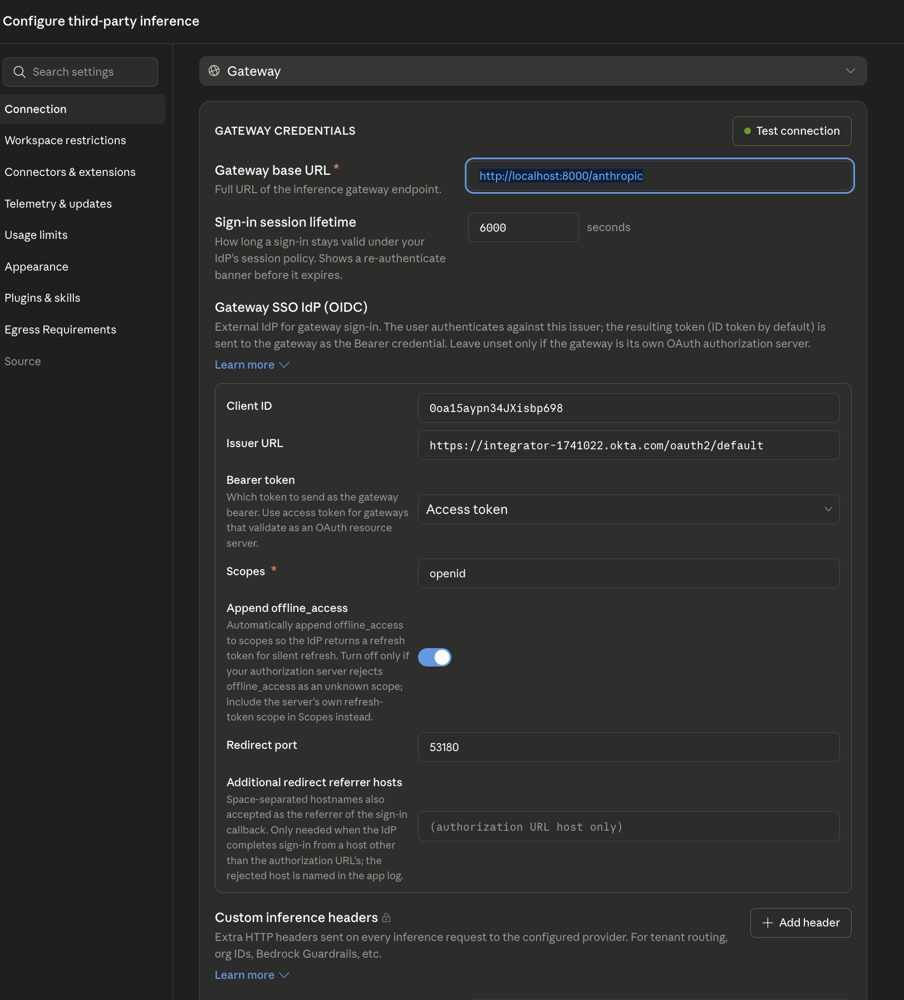

# Claude Desktop app settings

Claude Desktop → **Configure third-party inference** → **Connection** →
set the provider type to **Gateway**. This file gets a new section per
module as the gateway's auth semantics change; the **Gateway base URL** is
the one setting that stays constant across every module:

```
http://localhost:8000/anthropic
```

## Module 1 — general proxying (no auth)



1. **Gateway base URL**: `http://localhost:8000/anthropic`
2. **Gateway API key**: the field is required (`*`) by Desktop's UI even
   though Kong doesn't check it in this module — put any placeholder
   value in. Kong injects the real Anthropic credential from its vault and
   overwrites whatever you send here.
3. **Gateway auth scheme**: doesn't matter for this module (Kong
   overwrites the `x-api-key` header regardless) — leave the default, or
   pick `x-api-key` for consistency with later modules.
4. **Credential kind**: `Static API key`.
5. Optional: turn on **Model discovery** — it auto-populates the model
   picker from `http://localhost:8000/anthropic/v1/models`, which module 1
   already proxies.

## Module 2 — key auth at Kong

1. **Gateway base URL**: same as module 1.
2. **Gateway API key**: your `KONG_CONSUMER_API_KEY` value from `.env` —
   this is a Kong-issued credential, not the real Anthropic key. You can
   also copy it straight from Konnect instead: **Consumers →
   claude-desktop → Credentials → Key Authentication → Copy**.

   

3. **Gateway auth scheme**: `x-api-key` — must match `key-auth`'s
   `config.key_names` in `kong/02-key-auth.yaml`, which is set to
   `x-api-key`.
4. **Credential kind**: `Static API key`.
5. A missing or wrong key now gets rejected with a `401` from Kong before
   the request ever reaches Anthropic. **Test connection** confirms it works:

   

## Module 3 — OIDC + Okta

Desktop has a native OIDC gateway login flow — this actually works,
correcting an earlier version of this doc that claimed it didn't.



1. **Gateway base URL**: same as modules 1-2.
2. **Sign-in session lifetime**: how long before Desktop shows a
   re-authenticate banner (its own timer, independent of Kong's
   `session_rolling_timeout`) — e.g. `6000` seconds.
3. **Gateway SSO IdP (OIDC)**:
   - **Client ID**: your `OKTA_CLIENT_ID`.
   - **Issuer URL**: your Okta issuer's **base** URL, e.g.
     `https://<your-okta-domain>/oauth2/default` — **not** the full
     `/.well-known/openid-configuration` discovery URL. This is different
     from `OKTA_ISSUER` in `.env`, which Kong's `openid-connect` plugin
     needs in the full discovery-URL form; Desktop derives the discovery
     document itself from the base issuer.
   - **Bearer token**: `Access token` — matches Kong's `bearer` auth
     method, which validates an OAuth access token.
   - **Scopes**: `openid`.
   - **Append offline_access**: **turn this off**, unless you've also
     enabled the `Refresh Token` grant on the Okta app (`docs/okta-setup.md`
     deliberately leaves it unchecked, so leaving this toggle on will make
     Okta reject the `offline_access` scope request).
   - **Redirect port**: `53180` — this is *why*
     `http://127.0.0.1:53180/callback` needed to be a registered redirect
     URI in Okta (`docs/okta-setup.md`, step 3): Desktop itself is the
     native client that opens your browser for login and listens on this
     local port for the callback.
   - **Additional redirect referrer hosts**: leave as the default
     (authorization URL host only) unless Okta completes sign-in from a
     different host than the authorization URL's.
4. Custom inference headers aren't needed for this module.

Modules 4-5 reuse this same OIDC connection — no Desktop config changes,
just make sure the `team` claim you're relying on is actually present in
the access token (Okta authorization server claims mapping), since that's
the token type selected above.
