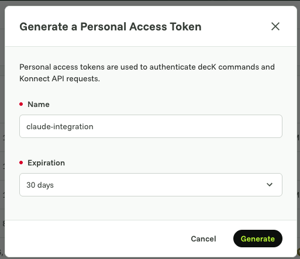
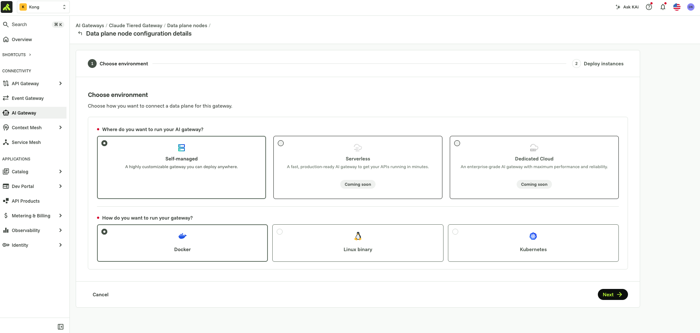

# Kong AI Gateway for Claude — tiered model entitlement

A worked example of putting **Kong AI Gateway** in front of **Claude** —
Chat, Cowork, and Code — so a platform team can gate, tier, and budget
access to Claude models by identity, without touching how developers use
the products themselves.

## Why a gateway in front of Claude at all

Point any of the Claude apps at a base URL and they'll talk to whatever
sits behind it, as long as it speaks the API shape they expect. That's the
opening for a platform team: put something in the middle that holds the
real upstream credential, decides who gets which model, and meters what
it costs — instead of every developer holding a raw Anthropic key.

## Kong Gateway: deploy it however your org needs to

Nothing about Kong Gateway is Claude-specific — it's a general-purpose API
and AI gateway that happens to be a good fit here because of how it
deploys:

- **Fully self-hosted** — control plane and data plane both run on your
  own infrastructure, for orgs that can't have configuration or metadata
  leave their network.
- **Hybrid (this example)** — the control plane lives in Kong Konnect
  (Kong's SaaS), the data plane runs wherever you choose (your VPC, your
  laptop for a POC), connected back over mTLS. You get a managed control
  plane without your traffic ever routing through Kong's cloud.
- **Fully managed** — both planes run in Konnect; you configure, Kong
  operates.

Same gateway, same configuration model, three deployment postures. This
example uses hybrid because it's the middle ground most platform teams
land on: managed control plane, data plane close to (or inside) the
network the traffic actually needs to stay in.

## Why Kong AI Gateway specifically

A generic reverse proxy gets you a stable URL. Kong AI Gateway adds the
parts a platform team actually needs to run Claude access as a product:

- **Enterprise-grade** — Konnect is the same control plane used to run
  API gateways at large-scale, multi-team, multi-region orgs: RBAC over
  who can change gateway config, audit logging, and the operational
  tooling (declarative config via `kongctl`, GitOps-friendly) this
  directory is built around.
- **Advanced security policies** — OIDC/SSO in front of model access
  (Step 4 below), per-group/per-consumer ACLs, mTLS on the data-plane
  connection, and content-inspection style policies (prompt guarding,
  PII detection) available on the same gateway if you need them later.
- **MCP registry and governed MCP access** — Claude Code and Cowork both
  reach for MCP servers as freely as they reach for models. Kong AI
  Gateway's MCP registry gives a platform team the same control over
  *which MCP servers a group can reach* that this example applies to
  *which Claude models a group can reach* — one governance model for
  both surfaces, not two.

This example only builds out the model-access and spend-limit half. MCP
governance is the natural next module if you extend this directory.

## What this example builds

Three Claude model tiers behind one route, gated by Okta group membership,
each group with its own USD-per-minute spend ceiling:

| Model             | Target              | Who gets it                  |
|-------------------|---------------------|-------------------------------|
| `claude-baseline` | Claude Haiku (Bedrock) | every authenticated group |
| `claude-mid`      | Claude Sonnet (Anthropic) | everyone except contractors |
| `claude-premium`  | Claude Opus (Anthropic)  | everyone except contractors |

| Consumer group     | Spend budget      |
|--------------------|-------------------|
| `ai-platinum`      | $5.00 / 60s        |
| `ai-standard`      | $1.00 / 60s        |
| `ai-contractors`   | $0.20 / 60s        |

Group membership comes from an Okta ID token's `groups` claim — nobody
gets a Kong-issued API key, and there's no per-user Consumer to manage.

## Architecture

```
┌────────────────────┐
│   Konnect (cloud)   │
│  control plane +    │
│  vault (secrets)    │
└──────────┬──────────┘
           │ hybrid mTLS
           ▼
┌───────────────┐        ┌──────────────────────┐        ┌────────────────────────┐
│  Claude Chat /│  HTTPS │   Kong AI Gateway     │  HTTPS │  Anthropic API /       │
│  Cowork / Code│───────▶│   (data plane)        │───────▶│  AWS Bedrock (Claude)  │
└───────────────┘        └──────────┬────────────┘        └────────────────────────┘
                                     │ validates bearer token
                                     ▼
                          ┌────────────────────┐
                          │   Okta (OIDC IdP)   │
                          └────────────────────┘
```

See `images/` for a rendered diagram and any console screenshots
(Okta app setup, Konnect consumer-group screens) — add them as you work
through the steps below.

## Prerequisites

- A Kong Konnect account with AI Gateway 2.0 enabled.
- A Konnect **Personal Access Token** — top-right profile menu → *Personal
  access tokens* → *Generate a Personal Access Token*, give it a name
  (e.g. `claude-integration`) and expiration, then *Generate*. This is
  what `kongctl` and any direct Konnect API calls authenticate with.

  <p float="left">
    
    
  </p>

- [`kongctl`](https://developer.konghq.com/kongctl/) installed and
  authenticated with that token (`export KONGCTL_DEFAULT_KONNECT_PAT=...`,
  then `kongctl version` to confirm).
- An Anthropic API key and/or AWS Bedrock credentials with Claude model
  access — whichever provider(s) you want to route to.
- An Okta tenant (or any OIDC-compliant IdP) with admin access to create
  an app and assign users to groups.
- `jq` and `curl` if you're seeding the vault via the API rather than the
  Konnect UI.
- Docker, if you follow Step 1 below as written (self-managed data plane
  run locally) — swap in whatever runtime fits your environment otherwise.

## Steps → files

Config is split into one `kongctl`-applied file per step, applied
cumulatively — each file is the full desired state for everything up to
that point, so `git diff` between files shows exactly what each step adds
(same convention the rest of this repo uses; see the top-level
[`README.md`](../README.md)).

| # | Step | File |
|---|------|------|
| 1 | Deploy the gateway (hybrid) | [`1-gateway.yaml`](1-gateway.yaml) |
| 2 | Integration setup with Claude | [`2-claude-integration.yaml`](2-claude-integration.yaml) |
| 3 | Vault integration | *(no kongctl file — see below)* |
| 4 | SSO with OIDC (Okta) | [`3-identity-provider.yaml`](3-identity-provider.yaml) |
| 5 | Spend limits (tiered cost budgets) | [`4-rate-limiting-policy.yaml`](4-rate-limiting-policy.yaml) |

### 1. Deploy the gateway (hybrid)

`kongctl apply -f 1-gateway.yaml` creates the AI Gateway 2.0 control plane
in Konnect. Once applied, it shows up under **AI Gateway** in the Konnect
UI:


The data-plane half of "hybrid" isn't a `kongctl` resource — it's a
separate connect step, and this is where Kong's deployment flexibility
actually shows up. Open the gateway → **Data plane nodes** — empty at
first — and click **Configure data plane**:


You're asked *where* and *how* to run it:

- **Where**: self-managed (anywhere you can run a container or binary —
  on-prem, your own VPC, your laptop), serverless, or dedicated cloud
  (fully Kong-hosted). Serverless and dedicated cloud were "coming soon"
  at the time of writing — self-managed is available today and is what
  this example uses.
- **How**: Docker, a Linux binary, or Kubernetes — pick whatever matches
  your platform team's existing deployment tooling.



For this example we're keeping it simple and running the data plane as a
**Docker container on a local machine** — the same steps apply unchanged
if you're targeting a Kubernetes cluster or a VM in your own cloud
instead. Selecting *Docker* generates a ready-to-run `docker run` command
pre-filled with this control plane's cluster endpoints and a short-lived
mTLS client certificate — copy it and run it as-is. (Not screenshotted
here on purpose: the generated command embeds your real control-plane
hostname and a live client certificate, which shouldn't end up in a
screenshot in a git repo. Shape of the command is below with the
identifying values replaced.)

```bash
docker run -d \
  -e "KONG_ROLE=data_plane" \
  -e "KONG_DATABASE=off" \
  -e "KONG_VITALS=off" \
  -e "KONG_CLUSTER_MTLS=pki" \
  -e "KONG_CLUSTER_CONTROL_PLANE=<control-plane-host>:443" \
  -e "KONG_CLUSTER_SERVER_NAME=<control-plane-host>" \
  -e "KONG_CLUSTER_TELEMETRY_ENDPOINT=<telemetry-host>:443" \
  -e "KONG_CLUSTER_TELEMETRY_SERVER_NAME=<telemetry-host>" \
  -e "KONG_CLUSTER_CERT=..." \
  -e "KONG_CLUSTER_CERT_KEY=..." \
  kong/kong-ai-gateway-dev:2.0.1-rc.4
```

By default the data plane exposes proxy traffic on `8000` (HTTP) and
`8443` (HTTPS):

```
$ docker container ls | grep :8443
09cdbd946618   kong/kong-ai-gateway-dev:2.0.1-rc.4   Up ...   0.0.0.0:8000->8000/tcp, 0.0.0.0:8443->8443/tcp   zealous_moore
```

Back in Konnect, the node shows up as **Connected** / **In sync** within a
few seconds:


If you'd rather not paste the generated cert/key inline, save them under
`secrets/` (git-ignored, never commit them) and reference the files from
your own `docker run`/compose setup instead — see this repo's
`docker-compose.aigw2.yml` for that pattern.

### 2. Integration setup with Claude

`2-claude-integration.yaml` adds the model providers (Anthropic direct,
AWS Bedrock) and one open `claude-chat` model at `/anthropic`. Point any
Claude app's custom base URL setting at this route to confirm the
round-trip works before layering on auth or limits.

### 3. Vault integration

Every credential in these files is a `{vault://claude-gateway-vault/<key>}`
reference, never a literal value. `kongctl` has no declarative resource
for creating the vault or its backing config store — that's a one-time,
scriptable API step:

1. Create a config store scoped to this AI Gateway.
2. Seed it with your real secrets from a local `.env` (copy
   `.env.example`, fill it in, never commit it).
3. Create an `ai_gateway_vault` named `claude-gateway-vault` pointing at
   that config store.

See `../scripts/00-bootstrap-konnect-2.0.sh` in this repo for a working
version of that sequence to adapt (it does the same three steps for the
adjacent `kong-2.0/` track).

### 4. SSO with OIDC (Okta)

`3-identity-provider.yaml` adds an `openid-connect` identity provider that
reads the caller's Okta group membership and three consumer groups
(`ai-platinum`, `ai-standard`, `ai-contractors`). `claude-chat` now
requires a valid, correctly-grouped Okta token — any other IdP that issues
an OIDC ID token with a groups claim drops in the same way.

### 5. Apply spend limits

`4-rate-limiting-policy.yaml` replaces the single open model with the
three tiers from the table above and adds an `ai-rate-limiting-advanced`
policy that budgets each consumer group in **USD per minute**, not
tokens — the three tiers span a real price range, so a token ceiling
would mean three different real-dollar budgets depending on which model a
caller happened to pick.

## Repo layout

```
├── README.md
├── .env.example              # vars this directory's vault gets seeded from
├── .gitignore
├── 1-gateway.yaml             # Step 1
├── 2-claude-integration.yaml  # Step 2
├── 3-identity-provider.yaml   # Step 4 (SSO)
├── 4-rate-limiting-policy.yaml # Step 5 (spend limits)
├── images/                    # architecture diagram, console screenshots
└── secrets/                   # local-only staging for real credentials (git-ignored)
```

## Secrets

Nothing under this directory ever holds a real credential. `.env` (copied
from `.env.example`) and anything under `secrets/` are git-ignored — see
[`secrets/README.md`](secrets/README.md) for what goes there. Every
`*.yaml` file references secrets as `{vault://claude-gateway-vault/<key>}`,
resolved by Kong at request time, not by `kongctl` at apply time.

## Status

This is a starting example, not a live-verified deployment — validate
every file with `kongctl diff -f <file>` against your own Konnect org
before applying, and adjust field names where your `kongctl`/Konnect
version's schema differs (each file notes the specific fields worth
double-checking with `kongctl explain`).
